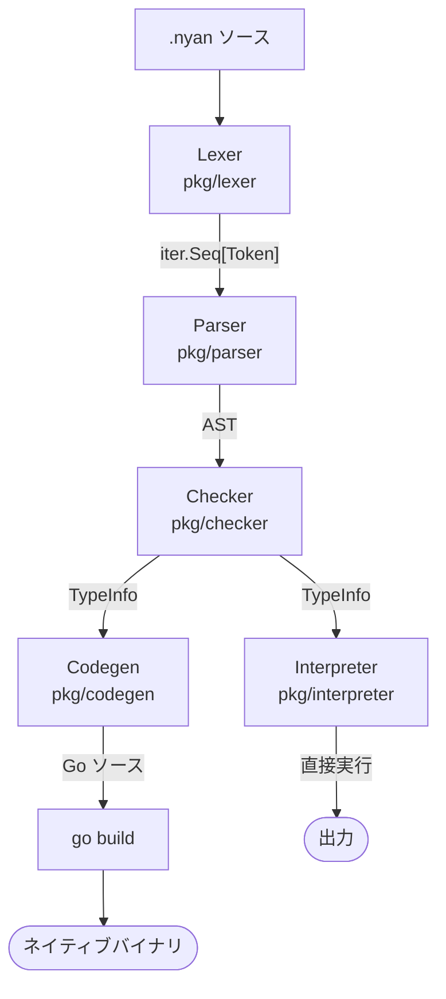

## はじめに

「猫語でプログラミングできる言語」を作りました。変数宣言は `nyan`、関数定義は `meow`、`if` は `sniff`、`while` は `purr`、ラムダは `paw`、`print` は `nya`。エラーメッセージまで `Hiss! ... , nya~` と猫が威嚇してきます。

```nyan
nyan name = "Nyantyu"

meow greet(who string) string {
  bring "Hello, " + who + "!"
}

nya(greet(name))
```

```
Hello, Nyantyu!
```

……という見た目のネタはここまでです。この記事で本当に書きたいのは、その下で動いている仕組みのほうです。Meow は **`.nyan` ファイルを Go のソースコードにトランスパイルし、Go ツールチェインでネイティブバイナリにコンパイルする**言語です。インタプリタではなく、`meow build hello.nyan` を叩くと `./hello` という単体で動く実行ファイルができます。

この記事では、その実装を頭から終わりまで順に追っていきます。読み終わったときに持ち帰ってほしいのは、次のようなことです。

- **Go にトランスパイルする**という設計を選ぶと、何が無料で手に入り、何を自分で書くことになるのか
- Go 1.23 で入った `iter.Seq` / `iter.Pull` を使うと、字句解析器と構文解析器の接続がどれだけ素直に書けるか
- Pratt 構文解析（top-down operator precedence）の実装が、実際どれくらい短いか
- **漸進的型付け（gradual typing）の型検査結果が、そのままコード生成の分岐になる**という設計。同じ足し算が、`int64` の素の Go コードに落ちることもあれば、`meow.Value` をボックス化して回すコードに落ちることもある
- ブラウザには Go ツールチェインがないので、Playground 用に **AST を直接歩く木構造インタプリタという第二のバックエンド**を持つことになった話と、その維持コスト

コードはすべて OSS で公開しています。記事中の `.nyan` サンプルはすべて実際に実行して出力を確認したもので、生成された Go コードも `meow transpile` の実出力をそのまま貼っています。

- 公式サイト: https://meow.oreha.dev/
- ブラウザで試せる Playground: https://meow.oreha.dev/playground/
- GitHub: https://github.com/135yshr/meow

:::message
記事中の実行結果は Meow v0.21.4 / Go 1.26.0 で確認しています。Meow のビルドには Go 1.26 以降が必要です。
:::

## なぜ「Go にトランスパイルする」のか

自作言語を作るときの実行方式は、ざっくり次の選択肢があります。

| 方式 | 実装コスト | 実行速度 | 配布 |
| --- | --- | --- | --- |
| 木構造インタプリタ | 低い | 遅い | ランタイムが必要 |
| バイトコード VM | 中 | そこそこ | ランタイムが必要 |
| LLVM でネイティブ | 高い | 速い | 単体バイナリ |
| **既存の高級言語にトランスパイル** | **低い** | **ホスト言語なり** | **ホスト言語なり** |

トランスパイル方式の旨味は、**「面倒なところを全部ホスト言語に押しつけられる」**点に尽きます。ターゲットを Go にすると、具体的に次のものが無料で付いてきます。

- **レジスタ割り当て・命令選択・最適化**: Go コンパイラの仕事
- **GC**: Go のランタイムの仕事
- **クロスコンパイル**: `GOOS` / `GOARCH` を渡すだけ
- **単一静的バイナリ**: Go のデフォルト挙動
- **標準ライブラリ**: あとで触れますが、Meow からは `nab go "net/url"` と書くだけで Go のパッケージをそのまま呼べます

代わりに自分で書くことになるのは、**字句解析・構文解析・意味解析・コード生成、そしてランタイムライブラリ**です。この記事の残りは、その 5 つの話です。

## パイプライン全体像

Meow のコンパイルパイプラインはこうなっています。



これを束ねているのが `compiler/compiler.go` です。実体は驚くほど素直で、こうなっています。

```go
// compiler/compiler.go
func (c *Compiler) CompileToGo(source, filename string) (string, error) {
	l := lexer.New(source, filename)

	p := parser.New(l.Tokens())
	prog, errs := p.Parse()
	// ... パースエラーをまとめて返す ...

	ch := checker.New()
	typeInfo, typeErrs := ch.Check(prog)
	// ... 型エラーをまとめて返す ...

	gen := codegen.New()
	gen.SetTypeInfo(typeInfo)
	raw, err := gen.Generate(prog)
	if err != nil {
		return "", err
	}
	formatted, err := format.Source([]byte(raw))
	if err != nil {
		// 整形に失敗しても、デバッグ用に生の出力を返す
		return raw, nil
	}
	return string(formatted), nil
}
```

注目してほしいのは最後の `format.Source` です。標準ライブラリの `go/format` に通しているだけで、**生成コードが `gofmt` 済みになります**。トランスパイラを書いていると生成コードのインデントを整える処理をつい自作しがちですが、Go をターゲットにしているならこれも「無料」の部類です。しかも整形に失敗したときは生のコードをそのまま返すので、生成器のバグを潰すときに「壊れた Go コードそのもの」を目視できます。地味ですが、これはかなり効きます。

## Lexer: `iter.Seq[Token]` を返す

字句解析器の役割は、文字列を意味のある単位（トークン）に切ることです。

まずトークンの定義から見ます。`pkg/token` はトークン種別の `const` ブロックと、キーワード表を持っています。

```go
// pkg/token/token.go
const (
	// Special
	ILLEGAL TokenType = iota
	EOF
	COMMENT
	// Literals
	IDENT
	INT
	// ... 中略 ...
	// Keywords
	keywordsStart
	NYAN     // nyan (let)
	MEOW     // meow (func)
	BRING    // bring (return)
	SNIFF    // sniff (if)
	SCRATCH  // scratch (else)
	PURR     // purr (while)
	PAW      // paw (lambda)
	NYA      // nya (print)
	// ... 中略 ...
	keywordsEnd
)

var keywords = map[string]TokenType{
	"nyan":  NYAN,
	"meow":  MEOW,
	"bring": BRING,
	"sniff": SNIFF,
	// ...
}

func LookupIdent(ident string) TokenType {
	if tok, ok := keywords[ident]; ok {
		return tok
	}
	return IDENT
}
```

小技が 2 つあります。

1 つめは `keywordsStart` / `keywordsEnd` という**番兵定数**です。キーワードを `iota` ブロックのこの 2 つの間に並べておくと、「このトークンはキーワードか？」の判定が範囲比較 1 行で済みます。

```go
func (t TokenType) IsKeyword() bool {
	return t > keywordsStart && t < keywordsEnd
}
```

2 つめは、トークン名の文字列化を手書きしていないことです。`TokenType` には

```go
//go:generate stringer -type=TokenType
type TokenType int
```

が付いていて、`go generate ./...` で `tokentype_string.go` が生成されます。トークン種別を追加したときに `String()` の更新を忘れてエラーメッセージが `TokenType(47)` になる、という古典的な事故がなくなります。

さて字句解析器本体です。Meow の lexer は、トークンのスライスを返しません。**`iter.Seq[token.Token]` を返します。**

```go
// pkg/lexer/lexer.go
func (l *Lexer) Tokens() iter.Seq[token.Token] {
	return func(yield func(token.Token) bool) {
		for {
			l.skipWhitespace()
			if l.pos >= len(l.input) {
				yield(l.makeToken(token.EOF, "", l.currentPos()))
				return
			}
			pos := l.currentPos()
			r := l.peek()

			switch {
			case r == '\n':
				l.advance()
				if !yield(l.makeToken(token.NEWLINE, "\n", pos)) {
					return
				}
			case r == '"':
				if !yield(l.readString()) {
					return
				}
			case unicode.IsDigit(r):
				if !yield(l.readNumber()) {
					return
				}
			case unicode.IsLetter(r) || r == '_':
				if !yield(l.readIdent()) {
					return
				}
			// ... 演算子・区切り文字が続く ...
			}
		}
	}
}
```

`iter.Seq[V]` は Go 1.23 で標準ライブラリ入りした型で、正体は `func(yield func(V) bool)` というただの関数型です。`range` 文がこれを直接回せるので、利用側はこう書けます。

```go
for tok := range lexer.New(src, "demo.nyan").Tokens() {
	// ...
}
```

実際に動かしてみます。

```go
package main

import (
	"fmt"

	"github.com/135yshr/meow/pkg/lexer"
	"github.com/135yshr/meow/pkg/token"
)

func main() {
	src := "nyan age = 3\nnya(age)\n"
	for tok := range lexer.New(src, "demo.nyan").Tokens() {
		if tok.Type == token.EOF {
			break
		}
		fmt.Printf("%-8v %-8q %s\n", tok.Type, tok.Literal, tok.Pos)
	}
}
```

```
NYAN     "nyan"   demo.nyan:1:1
IDENT    "age"    demo.nyan:1:6
ASSIGN   "="      demo.nyan:1:10
INT      "3"      demo.nyan:1:12
NEWLINE  "\n"     demo.nyan:1:13
NYA      "nya"    demo.nyan:2:1
LPAREN   "("      demo.nyan:2:4
IDENT    "age"    demo.nyan:2:5
RPAREN   ")"      demo.nyan:2:8
NEWLINE  "\n"     demo.nyan:2:9
```

ポイントを 3 つ。

**全トークンを事前に配列へ溜めない。** ソースが何 MB あってもメモリに乗るのはトークン 1 個分です。これ自体はよくある話ですが、`iter.Seq` のおかげで「チャネルとゴルーチンを使う」「明示的なステートマシンを書く」といった代償なしに、素直な `for` ループのまま遅延化できているのが嬉しいところです。

**`yield` の戻り値を見る。** `if !yield(...) { return }` は「消費側がもう要らないと言ったので打ち切る」という意味です。ここを手抜きすると、消費側が `break` しても字句解析が最後まで走り切ってしまいます。

**`NEWLINE` をトークンとして出す。** Meow は改行が文の区切りなので、改行を捨てずにトークン化しています。そしてすべてのトークンが `Position`（ファイル名・1 始まりの行・列）を持ちます。この位置情報は、後でエラーメッセージのためだけでなく、**生成される Go コードの中にまで埋め込まれます**。これは後半でもう一度出てきます。

## Parser: `iter.Pull` と Pratt 構文解析

ここが個人的にいちばん面白かったところです。

### push と pull の食い違い

字句解析器は `iter.Seq` を返します。これは **push 型**、つまり「トークンができたら `yield` を呼ぶ。制御を握っているのは字句解析器側」というモデルです。

一方、構文解析器がやりたいのは「**今のトークンを見る**」「**1 つ先を覗き見る（lookahead）**」「必要なら 1 つ進める」という操作です。これは **pull 型**、つまり「欲しくなったときに取りに行く。制御を握っているのは構文解析器側」のモデルです。

両者は素朴には噛み合いません。従来 Go でこれをやろうとすると、

- 字句解析器にチャネルへ送らせて、構文解析器がチャネルから受け取る（ゴルーチンリークが怖い）
- 字句解析器を「呼ばれるたびに 1 トークン返す」明示的なステートマシンとして書き直す（スキャンのループ構造が壊れて読みにくい）

のどちらかでした。

Go 1.23 の `iter.Pull` は、この変換をそのまま提供してくれます。

```go
// pkg/parser/parser.go
type Parser struct {
	next func() (token.Token, bool)
	stop func()
	cur  token.Token
	peek token.Token
	errs []*ParseError
}

func New(tokens iter.Seq[token.Token]) *Parser {
	next, stop := iter.Pull(tokens)
	p := &Parser{next: next, stop: stop}
	p.advance()
	p.advance()
	return p
}
```

`iter.Pull` は push 型のシーケンスを受け取り、`next()` と `stop()` の 2 つの関数を返します。内部ではコルーチンを使って、`yield` が呼ばれるたびに制御を呼び出し側へ戻しています。**字句解析器側のコードは 1 行も変えずに、pull 型として使えるようになります。**

`New` の最後で `p.advance()` を 2 回呼んでいるのは、`cur`（現在のトークン）と `peek`（1 つ先）を両方埋めるためです。これで LL(1) の先読みが揃います。

```go
func (p *Parser) advance() token.Token {
	prev := p.cur
	p.cur = p.peek
	tok, ok := p.next()
	if ok {
		p.peek = tok
	} else {
		p.peek = token.Token{Type: token.EOF}
	}
	return prev
}
```

注意点が 1 つあります。`iter.Pull` が返す `stop` は**必ず呼ぶ必要があります**。途中でパースを打ち切ったとき（構文エラーで中断したときなど）、`stop` を呼ばないと裏側のコルーチンが解放されません。Meow では `Parse` の冒頭で `defer` しています。

```go
func (p *Parser) Parse() (*ast.Program, []*ParseError) {
	defer p.stop()
	prog := &ast.Program{}
	p.skipNewlines()
	for p.cur.Type != token.EOF {
		stmt := p.parseStmt()
		if stmt != nil {
			prog.Stmts = append(prog.Stmts, stmt)
		}
		p.skipNewlines()
	}
	if len(p.errs) > 0 {
		return nil, p.errs
	}
	return prog, nil
}
```

### 文は再帰下降で

文（statement）のパースは、現在のトークンで分岐する再帰下降です。ここは特に凝ったことはしていません。

```go
func (p *Parser) parseStmt() ast.Stmt {
	switch p.cur.Type {
	case token.NYAN:
		return p.parseVarStmt()
	case token.MEOW:
		return p.parseFuncStmt()
	case token.TRILL:
		return p.parsePureFuncStmt()
	case token.BRING:
		return p.parseReturnStmt()
	case token.SNIFF:
		return p.parseIfStmt()
	case token.PURR:
		return p.parsePurrStmt()
	// ... bolt / slink / nab / kitty / breed / collar / pose / groom ...
	default:
		return p.parseExprStmtOrAssign()
	}
}
```

言語機能を 1 つ足すたびに、ここに 1 行 `case` が増えていきます。自作言語を育てるときは、この `switch` が実質的な「言語の目次」になります。

### 式は Pratt 構文解析で

式（expression）のほうは Pratt 構文解析、いわゆる top-down operator precedence を使っています。演算子ごとに文法規則を積み上げる（`expr → term → factor → ...`）BNF 直訳の方式に比べて、**優先順位を数値の表として一箇所に持てる**のが利点です。

優先順位はこの `iota` ブロックだけです。

```go
// pkg/parser/parser.go
const (
	precNone  = iota
	precCatch // ~>
	precOr    // ||
	precAnd   // &&
	precEq    // == !=
	precCmp   // < > <= >=
	precPipe  // |=|
	precAdd   // + -
	precMul   // * / %
	precUnary // ! -
	precCall  // () []
)

func (p *Parser) infixPrec(typ token.TokenType) int {
	switch typ {
	case token.OR:
		return precOr
	case token.AND:
		return precAnd
	case token.EQ, token.NEQ:
		return precEq
	case token.LT, token.GT, token.LTE, token.GTE:
		return precCmp
	case token.TILDEARROW:
		return precCatch
	case token.PIPE:
		return precPipe
	case token.PLUS, token.MINUS:
		return precAdd
	case token.STAR, token.SLASH, token.PERCENT:
		return precMul
	default:
		return precNone
	}
}
```

そして本体はこれだけです。**11 行**です。

```go
func (p *Parser) parseExpr(minPrec int) ast.Expr {
	left := p.parsePostfix(p.parsePrefix())
	for {
		prec := p.infixPrec(p.cur.Type)
		if prec <= minPrec {
			break
		}
		left = p.parseInfix(left, prec)
	}
	return left
}
```

読み方はこうです。

1. まず前置（リテラル、識別子、単項演算子、ラムダ、リスト、`peek` 式、括弧など）を 1 つ食べて `left` にする
2. 次のトークンが中置演算子で、その優先順位が「今要求されている下限」より高ければ、それを取り込んで `left` を膨らませる
3. 下限以下になったら抜ける

`parseInfix` の中で右辺を `p.parseExpr(prec)` と**同じ優先順位**で再帰させているのが左結合のポイントです（`1 - 2 - 3` が `(1 - 2) - 3` になる）。右結合にしたい演算子があれば `p.parseExpr(prec - 1)` にします。

```go
func (p *Parser) parseInfix(left ast.Expr, prec int) ast.Expr {
	tok := p.advance()
	if tok.Type == token.PIPE {
		right := p.parseExpr(prec)
		return &ast.PipeExpr{Token: tok, Left: left, Right: right}
	}
	if tok.Type == token.TILDEARROW {
		right := p.parseExpr(prec)
		return &ast.CatchExpr{Token: tok, Left: left, Right: right}
	}
	right := p.parseExpr(prec)
	return &ast.BinaryExpr{Token: tok, Op: tok.Type, Left: left, Right: right}
}
```

パイプ `|=|` とエラー回復 `~>` も、ただの中置演算子として同じ枠組みに乗っています。**新しい二項演算子を足すコストが、「トークンを 1 個定義して `infixPrec` に 1 行足す」だけ**になるのが Pratt 構文解析の効きどころです。

パイプはこう書けます。

```nyan
nyan nums = [1, 2, 3, 4, 5, 6, 7, 8, 9, 10]
nyan result = nums |=| picky(paw(x) { x % 2 == 0 }) |=| lick(paw(x) { x * x })
nya(result)
```

```
[4, 16, 36, 64, 100]
```

`picky` がフィルタ、`lick` がマップ、`curl` が畳み込みです（猫が毛づくろいで舐める・選り好みする・丸まる、の連想です）。

## Checker: 漸進的型付けと `TypeInfo`

構文解析が終わると AST ができます。次は意味解析です。

Meow の型システムは **漸進的型付け（gradual typing）** です。ただし「どこでも型注釈が省略できる」わけではなく、実際のルールはもう少し具体的です。

- `meow` 関数のシグネチャでは**型注釈が必須**。引数に注釈がなければエラー、`bring` があるのに戻り値型がなければエラー
- `nyan` の変数宣言と `paw` ラムダの引数では**省略可能**。省略すると初期化式から推論される

たとえば型注釈を省いた関数はこう怒られます。

```nyan
meow add(a, b) {
  bring a + b
}
```

```
Hiss! Parameter "a" of function add must have a type annotation at add.nyan:1:1, nya~
Hiss! Parameter "b" of function add must have a type annotation at add.nyan:1:1, nya~
Hiss! Function add has bring statements but no return type annotation at add.nyan:1:1, nya~
```

では何が「漸進的」なのか。**型注釈で書ける型そのものに幅がある**、というのがここでの漸進性です。`int` / `float` / `string` / `bool` は具体的な型ですが、`litter`（リスト）や `basket`（文字列キーの辞書）、`furball`（エラー）、ユーザー定義の `kitty`（構造体）は、要素の型まで静的に固定されるとは限りません。次の節で見るように、**この違いがそのままコード生成の分岐になります。**

### 2 パス構成

`checker.Check` は AST を 2 周します。

**1 周目**は宣言の登録です。トップレベルの関数・`kitty`・`breed`（型エイリアス）・`collar`（newtype）・`pose`（インタフェース）の名前と型を先に表へ入れます。これをやらないと、下で定義された関数を上から呼べません。

```go
// pkg/checker/checker.go
// First pass: register type/function names as placeholders
for _, stmt := range prog.Stmts {
	if ks, ok := stmt.(*ast.KittyStmt); ok {
		c.info.KittyTypes[ks.Name] = types.KittyType{Name: ks.Name}
	}
	if fn, ok := stmt.(*ast.FuncStmt); ok {
		ft := c.funcSignatureType(fn)
		c.info.FuncTypes[fn.Name] = ft
		c.define(fn.Name, ft)
		if fn.Pure {
			c.pureFuncs[fn.Name] = true
		}
	}
}
```

**2 周目**が本番の型検査です。スコープスタックを持ちながら AST を歩き、型注釈の整合を確かめ、各式の型を記録します。

### 出力は `TypeInfo`

検査結果は `TypeInfo` という 1 つの構造体にまとまって、コード生成器に渡されます。

```go
// pkg/checker/checker.go
type TypeInfo struct {
	ExprTypes   map[ast.Expr]types.Type
	VarTypes    map[string]types.Type
	FuncTypes   map[string]types.FuncType
	KittyTypes  map[string]types.KittyType
	AliasTypes  map[string]types.AliasType
	CollarTypes map[string]types.CollarType
	TrickTypes  map[string]types.TrickType
	LearnImpls  map[string]map[string]types.FuncType // typeName → methodName → FuncType
	ImportNames map[string]string                    // effective name → package path
	// FuncRefs holds the identifier occurrences that name a top-level function
	// rather than something written inside a body that took the name over.
	FuncRefs map[*ast.Ident]bool
}
```

`ExprTypes` が `map[ast.Expr]types.Type`、つまり **AST ノードのポインタをキーにした map** になっているのがコツです。AST に型フィールドを生やして破壊的に書き込む設計もありますが、脇に map を持つほうが AST の定義が型検査から独立したままになり、型検査を通さずに AST を使う経路（フォーマッタや linter）が素直に書けます。

`FuncRefs` はやや変わった存在です。「この識別子はトップレベル関数を指しているのか、それともローカル変数に隠されているのか」を記録しています。というのも、**関数を値として持つローカル変数は、隠しているトップレベル関数とまったく同じ型を持つため、型からは区別できない**からです。名前がどの宣言に届くかはスコープを見ていた検査器にしか分からないので、その答えをここに書き留めておいて、後段に渡しています。

### 型検査器は型だけを見ているわけではない

ついでに紹介しておくと、Meow の `trill` 修飾子を付けた関数は「純粋関数」として検査されます。

```nyan
trill meow double(x int) int {
  bring x * 2
}

trill meow shout(x int) int {
  nya(x)
  bring x
}
```

```
Hiss! pure function shout must not call impure builtin nya at pure.nyan:6:6, nya~
```

副作用のある組み込み（`nya` など）の呼び出し、純粋でないユーザー関数の呼び出しや値としての参照、`nab` で取り込んだパッケージの使用が、すべて `trill` の中では禁止されます。**型検査器は「型が合っているか」だけでなく、「その言語が約束したいことが守られているか」を確かめる場所**だ、という良い例だと思っています。

## Codegen: ボックス化するか、素の Go 型で出すか

ここが Meow でいちばん設計として面白い部分です。

### 2 つのコード生成パス

生成器には **boxed パス**と **typed パス**の 2 つがあります。関数宣言のコード生成は、入口でこう分岐します。

```go
// pkg/codegen/codegen.go
func (g *Generator) genFuncDecl(fn *ast.FuncStmt) string {
	if g.isFullyTypedFunc(fn) {
		return g.genTypedFuncDecl(fn)
	}
	// ... boxed パス ...
}
```

判定条件が `isFullyTypedFuncType` です。

```go
// isNativeType reports whether t maps to a native Go type (int64, float64, string, bool).
// ListType, FurballType, and AnyType are NOT native types; they use meow.Value.
func isNativeType(t types.Type) bool {
	switch t.(type) {
	case types.IntType, types.ByteType, types.FloatType, types.StringType, types.BoolType:
		return true
	case types.AliasType:
		return isNativeType(types.Unwrap(t))
	}
	return false
}

func isFullyTypedFuncType(ft types.FuncType) bool {
	if !isNativeType(ft.Return) {
		return false
	}
	for _, p := range ft.Params {
		if !isNativeType(p) {
			return false
		}
	}
	return true
}
```

つまり **引数と戻り値が全部「Go のプリミティブ型に 1 対 1 で落ちる型」のときだけ** typed パスに入ります。対応表はこれです。

```go
func goTypeString(t types.Type) string {
	switch t := t.(type) {
	case types.IntType:
		return "int64"
	case types.ByteType:
		return "byte"
	case types.FloatType:
		return "float64"
	case types.StringType:
		return "string"
	case types.BoolType:
		return "bool"
	case types.AliasType:
		return goTypeString(t.Underlying)
	default:
		return "meow.Value"
	}
}
```

`breed`（型エイリアス）が `Unwrap` されて中身の型として扱われるので、`breed Meters = float` と書いても実行時コストはゼロです。

### 実際に比べてみる

言葉より出力を見たほうが早いので、2 つの `.nyan` を `meow transpile` に通します。

**その 1: すべてプリミティブ型**

```nyan
meow add(a int, b int) int {
  bring a + b
}

nya(add(3, 7))
```

```
$ meow run add.nyan
10
```

```go
$ meow transpile add.nyan
// Code generated by meow compiler. DO NOT EDIT.
package main

import meow "github.com/135yshr/meow/runtime/meowrt"

func add(a int64, b int64) int64 {
	__caller := meow.Where()
	_ = __caller
	meow.Here("add.nyan:2:3")
	return meow.Returning(__caller, (a + b))
}

func __meow_main() meow.Value {
	meow.Here("add.nyan:5:1")
	if __f, __ok := meow.AsFurball(meow.Nya(meow.NewInt(add(int64(3), int64(7))))); __ok {
		return __f
	}
	return meow.NewNil()
}

func main() {
	meow.RunMain(__meow_main)
}
```

`func add(a int64, b int64) int64` で、足し算は素の Go の `+` です。ボックス化も、インタフェース越しのディスパッチも、型スイッチもありません。Go コンパイラから見れば、これはただの Go の関数です。インライン展開もレジスタ割り当ても普通に効きます。

**その 2: 引数に `litter`（リスト）が混じる**

```nyan
meow total(xs litter) int {
  bring curl(xs, 0, paw(acc, x) { acc + x })
}

nya(total([1, 2, 3, 4, 5]))
```

```
$ meow run total.nyan
15
```

```go
$ meow transpile total.nyan
// Code generated by meow compiler. DO NOT EDIT.
package main

import meow "github.com/135yshr/meow/runtime/meowrt"

func total(xs meow.Value) meow.Value {
	__caller := meow.Where()
	_ = __caller
	meow.Here("total.nyan:2:3")
	return meow.Returning(__caller, meow.Curl(xs, meow.NewInt(0), meow.NewFuncWithArity("lambda", 2, func(args ...meow.Value) meow.Value {
		acc := args[0]
		_ = acc
		x := args[1]
		_ = x
		__caller := meow.Where()
		_ = __caller
		return meow.Add(acc, x)
	})))
}

func __meow_main() meow.Value {
	meow.Here("total.nyan:5:1")
	if __f, __ok := meow.AsFurball(meow.Nya(total(meow.NewList(meow.NewInt(1), meow.NewInt(2), meow.NewInt(3), meow.NewInt(4), meow.NewInt(5))))); __ok {
		return __f
	}
	return meow.NewNil()
}

func main() {
	meow.RunMain(__meow_main)
}
```

同じ足し算が `meow.Add(acc, x)` になりました。`total` の戻り値は `int` と書いたのに `meow.Value` です。**引数に 1 つでも非ネイティブ型が混じると、関数まるごと boxed パスに落ちる**からです。ラムダは `meow.NewFuncWithArity("lambda", 2, func(args ...meow.Value) meow.Value {...})` という可変長のクロージャに変換され、引数は `args[0]`、`args[1]` から取り出されます。

### なぜ「全部ネイティブか、全部ボックスか」なのか

「引数ごとに部分的にネイティブにすればいいのでは」と思うかもしれません。ただ、そうすると箱詰め・箱開けの境界が関数の中に散らばります。`a`（ネイティブ）と `xs`（ボックス）を混ぜて演算するたびに、どちらに寄せるかの判断が必要になり、生成器の分岐がどんどん増えていきます。

**関数単位で全か無かにすると、境界が「呼び出し地点」1 箇所に集約されます。** 実際、typed な `add` を boxed な文脈から呼ぶ上の例では、`meow.NewInt(add(int64(3), int64(7)))` のように、引数で `int64(...)` に落とし、戻り値を `meow.NewInt(...)` で箱に戻す、という変換が呼び出し式のところだけで完結しています。逆に boxed な値を typed 文脈で使うときは `meow.AsInt(...)` のような開封が入ります。

これは「素朴だが破綻しない」設計だと思っています。**具体的な型で書けるところを具体的に書くほど、その関数がまるごとネイティブ側へ移る。書けないところは `meow.Value` のまま動き続ける。** 漸進的型付けの「漸進」が、生成コードのレベルで関数単位の粒度として現れている、ということです。

### 組み込み関数はランタイム関数への写像

組み込み関数の生成は、基本的には名前の対応表です。boxed パスの `genCall` はこうなっています。

```go
// pkg/codegen/codegen.go
if isIdent {
	switch ident.Name {
	case "nya":
		return fmt.Sprintf("meow.Nya(%s)", argStr)
	case "hiss":
		return fmt.Sprintf("meow.Hiss(%s)", argStr)
	case "lick":
		return fmt.Sprintf("meow.Lick(%s)", argStr)
	case "picky":
		return fmt.Sprintf("meow.Picky(%s)", argStr)
	case "curl":
		return fmt.Sprintf("meow.Curl(%s)", argStr)
	// ... len / head / tail / append / to_int / upper / trim / sort / ...
	}
}
```

対応先は `runtime/meowrt` パッケージです。**組み込み関数の実装は生成器ではなく普通の Go 関数として書かれていて、生成器はそこへの呼び出しを吐くだけ**、というのが要点です。組み込みを 1 つ足すのは「`runtime/meowrt` に Go 関数を書き、ここに `case` を 1 行足す」という作業になります。

typed パスの `genTypedCall` は、これに加えて**戻り値型が分かっている組み込みは自動で開封する**という処理を持っています。`len` は `int`、`upper` は `string`、`is_furball` は `bool`、といった表を持っていて、typed 文脈で呼ばれたときは `meow.AsInt(meow.Len(...))` のように開いた形で出します。ここにも 1 つ、いい判断が入っています。

```go
// round is deliberately absent: it hands back the kind of number it
// was given, so there is no one type to unbox it to.
```

`round` は引数と同じ種類の数値を返すので、開封先の型が 1 つに決まりません。だから表に入れない。**「分からないものは静かに boxed のままにする」**というのが、漸進的型付けの安全弁です。

## エラーは値: `Furball` と、生成コードに埋め込まれる位置情報

Meow のエラーは例外ではなく**値**です。`Furball`（毛玉）という型を持っていて、これが式の結果として返ってきます。

```nyan
meow divide(a int, b int) int {
  sniff (b == 0) {
    hiss("division by zero")
  }
  bring a / b
}

nya(divide(10, 2))
nya(divide(10, 0) ~> 0)
```

```
5
0
```

`~>` は「左が失敗したら右を使う」演算子です。右には値も関数も置けます。

生成された Go を見ると、この設計の帰結がよく分かります。

```go
func divide(a int64, b int64) int64 {
	__caller := meow.Where()
	_ = __caller
	meow.Here("err.nyan:2:3")
	if b == int64(0) {
		meow.Here("err.nyan:3:5")
		panic(meow.Hiss(meow.NewString("division by zero")).String())
	}
	meow.Here("err.nyan:5:3")
	return meow.Returning(__caller, (a / b))
}

func __meow_main() meow.Value {
	meow.Here("err.nyan:8:1")
	if __f, __ok := meow.AsFurball(meow.Nya(meow.NewInt(divide(int64(10), int64(2))))); __ok {
		return __f
	}
	meow.Here("err.nyan:9:1")
	if __f, __ok := meow.AsFurball(meow.Nya(meow.GagOr(meow.NewFunc("~>", func(args ...meow.Value) meow.Value {
		return meow.NewInt(divide(int64(10), int64(0)))
	}), meow.NewInt(0)))); __ok {
		return __f
	}
	return meow.NewNil()
}
```

読みどころが 3 つあります。

**1. エラー伝播は明示的なガードとして展開される。** `if __f, __ok := meow.AsFurball(...); __ok { return __f }` が文ごとに挟まっています。Go の `if err != nil { return err }` そのものです。Meow を書く人はこれを書かなくていいが、生成コードは律儀に書いている、という構図です。

**2. typed パスでは `hiss` が `panic` になる。** `divide` は `int64` を返す関数なので、`Furball` を戻り値として返す手段がありません。そこで typed パスの `hiss` は `panic(meow.Hiss(...).String())` として出ます。そしてその panic は、`~>` が展開された `meow.GagOr` の中の `recover`（あるいは `main` の `meow.RunMain`）で受け止められて、また `Furball` という値に戻ります。**「値としてのエラー」というモデルを、戻り値型がそれを許さない領域でも維持するための橋渡し**です。

生成器のコメントがこの意図をそのまま書いています。

```go
// In typed contexts a function returns a native Go type (int64, etc.)
// and cannot return a Furball value. Panic so that `gag`'s deferred
// recover converts the failure into a Furball at the boundary —
// this is the typed-path bridge to the value-propagation model.
```

**3. `~>` は評価を遅らせるサンク（thunk）に展開される。** `divide(10, 0) ~> 0` が `meow.GagOr(meow.NewFunc("~>", func(...) meow.Value { return ... }), meow.NewInt(0))` になっています。左辺を先に評価してしまうと panic がそのまま抜けてしまうので、クロージャに包んで `GagOr` の中の `defer/recover` の下で走らせる必要があるわけです。

### `meow.Here` / `meow.Where` / `meow.Returning` の正体

生成コードのそこら中にある `meow.Here("err.nyan:2:3")` は何かというと、**実行中の位置を記録するグローバル変数への代入**です。

```go
// runtime/meowrt/position.go
var here string

func Here(pos string) { here = pos }
func Where() string   { return here }

func Located(message string) string {
	if here == "" {
		return message
	}
	return here + ": " + message
}

func Returning[T any](pos string, v T) T {
	Here(pos)
	return v
}
```

ソースコードのコメントが、この設計の理由をきれいに説明しています。

> A failure knows what went wrong and not where. Everything a program reads from outside itself arrives as text, so `Cannot read "3 " as an Int` is a message a real program produces — and without a position, finding which of two hundred lines asked for that number is the reader's problem.

つまり、**エラーの「何が」は `Furball` が持っているが、「どこで」は持っていない**。実行時型変換の失敗は 200 行のうちどこでも起きうるので、位置がないと使い物にならない、という話です。

なぜ `Furball` 自身に位置を持たせず、グローバル変数 1 個にしたのか。これもコメントにあります。

> It is a single variable rather than something carried on each Furball because a Furball is built in a hundred places, and because the answer wanted is the same either way: a failure propagates without running further statements, so the last statement to start is the innermost one that was running.

失敗すると後続の文は走らないので、「最後に開始した文」＝「失敗した最内側の文」になる。だから 1 変数で足りる、という論法です。

そして `Returning` の役割が地味に賢い。関数から**正常に**戻るときだけ、呼び出し元の位置を復元します。

```go
func divide(...) int64 {
	__caller := meow.Where()   // 呼ばれたときの位置を覚えておく
	...
	return meow.Returning(__caller, (a / b))   // 正常復帰なら位置を戻す
}
```

これがないと、「呼び出しが成功して戻ってきた直後に、同じ文の別の場所で失敗した」ときに、**うまく動いた関数の最終行が犯人として報告されてしまいます**。逆に、関数が失敗したときは `Returning` に到達しないので、いちばん内側の本当に失敗した位置が残ります。

生成コードにこういう「実行時のメタ情報」を織り込めるのは、トランスパイル方式のわりと大きな利点です。ホスト言語のスタックトレースは生成後の Go コードの行番号を指してしまうので、元のソース位置は自分で運ぶしかありません。

## ランタイムと、Go の資産をそのまま借りる

### 標準ライブラリ

Meow の標準ライブラリは `nab "名前"` で取り込みます。

```go
// pkg/codegen/codegen.go
var stdPackages = map[string]string{
	"clock":   "github.com/135yshr/meow/runtime/clock",
	"env":     "github.com/135yshr/meow/runtime/env",
	"file":    "github.com/135yshr/meow/runtime/file",
	"http":    "github.com/135yshr/meow/runtime/http",
	"json":    "github.com/135yshr/meow/runtime/json",
	"random":  "github.com/135yshr/meow/runtime/random",
	"testing": "github.com/135yshr/meow/runtime/testing",
}
```

`nab "file"` を書くとこの import が登録され、`file.snoop(x)` のようなメンバ呼び出しが `meow_file.Snoop(x)` に落ちます（先頭を大文字にするだけ）。**標準ライブラリは「Go で書いた普通のパッケージ」であって、言語処理系の特別扱いではありません。**

### Go のパッケージを直接呼ぶ

もっと大胆なのが `nab go` です。

```nyan
nab go "strings"
nab go "net/url" tag u

nya(strings.to_upper("nyan"))

nyan parsed = u.parse("https://meow.oreha.dev/playground/")
nya(parsed["host"] + parsed["path"])
```

```
NYAN
meow.oreha.dev/playground/
```

生成される Go はこうです。

```go
// Code generated by meow compiler. DO NOT EDIT.
package main

import meow "github.com/135yshr/meow/runtime/meowrt"
import go_strings "strings"
import go_u "net/url"

var parsed meow.Value = meow.NewFurball("Hiss! undefined variable parsed, nya~")

func __meow_main() meow.Value {
	meow.Here("gonab.nyan:4:1")
	if __f, __ok := meow.AsFurball(meow.Nya(meow.CallGo("strings.to_upper", go_strings.ToUpper, meow.NewString("nyan")))); __ok {
		return __f
	}
	meow.Here("gonab.nyan:6:1")
	parsed = meow.CallGo("u.parse", go_u.Parse, meow.NewString("https://meow.oreha.dev/playground/"))
	// ...
}
```

`nab go "strings"` は **生成される Go ファイルにそのまま `import "strings"` を足します**。そして `strings.to_upper(...)` は `meow.CallGo("strings.to_upper", go_strings.ToUpper, ...)` になります。Go の関数値をそのまま渡し、ランタイム側がリフレクションで引数を変換して呼びます。

```go
// runtime/meowrt/bridge.go
func CallGoContext(ctx context.Context, what string, fn any, args ...Value) Value {
	rv := reflect.ValueOf(fn)
	if !rv.IsValid() || rv.Kind() != reflect.Func {
		return NewFurball("Hiss! %s is not something that can be called, nya~", what)
	}
	return callReflected(ctx, what, rv, args)
}
```

Meow 自体は標準ライブラリだけで書かれていてサードパーティ依存がゼロなのですが、**Meow で書かれたプログラムは `nab go "path"` で任意の Go パッケージに手が届きます**。依存は「Meow 処理系」ではなく「ビルドされるプログラム」に入る、という切り分けです。これはターゲットが Go だからこそ成立する仕掛けで、個人的にはトランスパイル方式を選んで一番得をしたところだと思っています。

### トップレベル変数の初期値が `Furball` な理由

もうひとつ、上の出力でちょっと変なものに気づいたかもしれません。

```go
var parsed meow.Value = meow.NewFurball("Hiss! undefined variable parsed, nya~")
```

トップレベルの `nyan` 束縛は Go のパッケージスコープ変数へ持ち上げられます（関数本体から見えるようにするため）。代入自体は元のソースの順番どおり `__meow_main` の中で行われるので、**代入より前に関数から読んでしまう可能性**が残ります。素の宣言のままだと `nil` の `meow.Value` を触ってクラッシュするので、あらかじめ「未定義変数」という `Furball` を入れてあるわけです。

生成器のコメントがこう書いています。

> Reaching one from a function that runs before the binding does is a real mistake, and a bare declaration would make it a nil dereference with nothing to read. Starting it as the same Furball the playground interpreter raises keeps the two backends saying the same thing.

最後の一文が次のテーマです。

## `go build` してネイティブバイナリへ

コード生成が終わったら、あとは Go ツールチェインに渡すだけです。`Build` がやっているのは要するにこれだけです。

1. 一時ディレクトリを作る
2. 生成した Go コードを `main.go` として書く
3. `go.mod` を書く
4. `go mod tidy` を走らせる
5. `go build -o <出力先> .` を走らせる
6. 一時ディレクトリを消す

`go.mod` の生成に少し工夫があります。

```go
// compiler/compiler.go
func buildModContent(goVersion, modRoot string) (string, error) {
	// ...
	if modRoot == "" {
		version, ok := runtimeRequirement()
		if !ok {
			return fmt.Sprintf("module meow_build\n\ngo %s\n", goVersion), nil
		}
		return fmt.Sprintf("module meow_build\n\ngo %s\n\nrequire %s %s\n",
			goVersion, meowModulePath, version), nil
	}
	return fmt.Sprintf("module meow_build\n\ngo %s\n\nrequire %s v0.0.0\n\nreplace %s => %s\n",
		goVersion, meowModulePath, meowModulePath, strconv.Quote(modRoot)), nil
}
```

生成コードは `github.com/135yshr/meow/runtime/meowrt` に依存しているので、それをどう解決するかが問題になります。

- Meow のソースツリーの中で作業しているとき（`findModuleRoot` がリポジトリを見つけたとき）は `replace` ディレクティブでローカルを指す。**ランタイムを直したその場でビルドを試せます**
- リリース版のバイナリを使っているときは、バイナリ自身に埋め込まれたビルド情報（`runtime/debug`）から自分のバージョンを読み、それを `require` に書く。**処理系のバージョンとランタイムのバージョンが自動的に一致します**

これは配布形態を持つトランスパイラを書くときに必ずぶつかる問題なので、参考になるかもしれません。

`nab go "github.com/aws/aws-sdk-go-v2/aws/arn@v1.32.0"` のように import パスへ直接バージョンを書いて固定することもできます。固定されたものは `go get path@version` で先に取りに行ってから `go mod tidy` します。`require` 行を手で書かないのは、**import パスからモジュール名は自動では分からない**（モジュールはパスの接頭辞のこともあれば全体のこともある）ためで、その解決はツールチェインに任せる、という判断です。

## もう一つのバックエンド: WASM Playground と木構造インタプリタ

ここまでの話には大前提があります。**`go build` が動くこと**です。

ブラウザでは動きません。でも「言語を作った」と言うなら、その場で試せる Playground は欲しい。というわけで Meow には**バックエンドが 2 つ**あります。

- **コンパイラ経路**（CLI の `meow run` / `meow build`）: Lexer → Parser → Checker → Codegen → `go build`
- **インタプリタ経路**（WASM Playground）: Lexer → Parser → Checker → **AST を直接歩く木構造インタプリタ**

前半 3 段は完全に共有で、Codegen + `go build` のところだけを `pkg/interpreter` に差し替えています。

WASM のエントリポイントは驚くほど小さいです。

```go
// cmd/playground/main_wasm.go
//go:build js && wasm

func runMeow(_ js.Value, args []js.Value) interface{} {
	source := args[0].String()

	l := lexer.New(source, "playground.nyan")
	p := parser.New(l.Tokens())
	prog, parseErrs := p.Parse()
	// ... パースエラーを JSON で返す ...

	c := checker.New()
	ti, checkErrs := c.Check(prog)
	// ... 型エラーを JSON で返す ...

	var buf bytes.Buffer
	interp := interpreter.New(&buf)
	interp.SetTypeInfo(ti)
	interp.SetStepLimit(10_000_000)
	if err := interp.RunSafe(prog); err != nil {
		b, _ := json.Marshal(result{Output: buf.String(), Error: err.Error()})
		return string(b)
	}

	b, _ := json.Marshal(result{Output: buf.String()})
	return string(b)
}

func main() {
	js.Global().Set("runMeow", js.FuncOf(runMeow))
	select {}
}
```

ビルドは `GOOS=js GOARCH=wasm go build -o playground/meow.wasm ./cmd/playground/` です。JS 側からは `runMeow(source)` という関数が 1 つ生えて、`{output, error}` の JSON が返ってきます。`select {}` でメインゴルーチンを止めておかないと、登録した関数ごとプログラムが終了してしまう、というのが WASM の作法です。

### ブラウザで走らせるための小細工

インタプリタ側には、ブラウザ特有の事情から来る工夫がいくつかあります。

**出力の横取り。** `meow.Nya` は `fmt.Print` で標準出力に書きます。ブラウザではそれを拾えないので、インタプリタは `io.Writer` に書く独自の `builtinNya` を持っています。だから `interpreter.New(&buf)` のように書き先を渡す API になっています。

**ステップ上限。** 無限ループでブラウザのタブを固めるわけにはいきません。`evalExpr` と `execStmt` の呼び出しごとにカウンタを回し、上限（既定 1,000 万）を超えたら専用の panic を上げて `RunSafe` が拾います。

```go
interp.SetStepLimit(10_000_000)
```

**`bring` は panic/recover で実装。** 木構造インタプリタで return を実装する定番の手ですが、`panic(returnSignal{Value: val})` を投げて、関数呼び出しの `defer/recover` で拾っています。`bolt`（break）と `slink`（continue）も同じく専用のシグナルです。

**ランタイムは共有する。** ここが効率のいいところで、インタプリタは `runtime/meowrt` を大量に再利用します。値の生成（`NewInt` / `NewList` / `NewKitty`）、演算子（`Add` / `Equal` / `LessThan`）、組み込み（`Lick` / `Picky` / `Curl` / `Gag`）、パターンマッチ（`MatchValue` / `MatchRange`）——すべて生成コードが呼ぶのと同じ関数です。**「意味論の実装」はランタイムに一箇所だけ置き、コンパイラとインタプリタはどちらもそれを呼ぶ**、という構造になっています。位置情報も同じで、インタプリタは AST を歩きながら `meowrt.Here(pos.String())` を呼ぶので、両バックエンドが同じ行番号を報告します。

### 二重バックエンドのコスト

いいことばかりではありません。**言語機能を 1 つ足すたびに、コード生成器とインタプリタの両方を直す必要があります。** リポジトリの `CLAUDE.md` にもそう書いてあります。

> A language change that touches semantics generally must be reflected in **both** codegen and the interpreter.

そして実際、ズレは起きます。共有しているのが「Lexer / Parser / Checker / ランタイム関数」までで、**「どの AST ノードをどう評価するか」だけが二重化されている**からです。境界の置き方自体は妥当だと思っていますが、二重化された部分は確実にズレの温床になります。

現状のテストは、この 2 経路を別々に押さえています。コンパイラ経路はゴールデンテスト（`testdata/` に `.nyan` と `.golden` をペアで置き、`go test ./compiler/` が生成 Go を突き合わせる。意図して変えたときは `make test-update` で再生成してから差分をレビューする）。インタプリタ経路は `pkg/interpreter` の Go ユニットテスト。それぞれは充実していますが、**「同じソースを両方に食わせて出力が一致するか」を直接確かめるテストは、いまのところ持っていません。**

もし同じ構成を取るなら、**両バックエンドの出力一致テストを最初から用意する**のを強くおすすめします。これは後から足すより、二重バックエンドにすると決めた日に足すほうがずっと安いはずです。

## Playground で試す

ここまでのサンプルは、`nab` を含むもの以外はそのままブラウザで動きます。インタプリタはブラウザに Go ツールチェーンが無いことを理由に `nab` / `nab go` の両方を拒否するので、`nab "file"` や `nab go "strings"` の例だけは手元の `meow run` で試してください。たとえば `peek`（パターンマッチ）で書いた FizzBuzz は、そのまま貼って動きます。

```nyan
meow fizzbuzz(n int) string {
  bring peek(n % 15) {
    0 => "FizzBuzz",
    3 => "Fizz", 6 => "Fizz", 9 => "Fizz", 12 => "Fizz",
    5 => "Buzz", 10 => "Buzz",
    _ => to_string(n)
  }
}

purr i (1..15) {
  nya(fizzbuzz(i))
}
```

```
1
2
Fizz
4
Buzz
Fizz
7
8
Fizz
Buzz
11
Fizz
13
14
FizzBuzz
```

コピーして貼るだけで動きます: https://meow.oreha.dev/playground/

## まとめ: Go にトランスパイルする言語を作るときの勘所

最後に、実装してみて「これは他の人にも効きそうだ」と思ったことをまとめます。

**1. `iter.Seq` / `iter.Pull` は字句解析器と構文解析器の接続に使うと綺麗にハマる。** 字句解析器は素直な `for` ループのまま遅延シーケンスになり、構文解析器は `iter.Pull` で先読み付きの pull 型として受け取れます。チャネルも明示的なステートマシンも要りません。`stop()` を `defer` するのだけ忘れないでください。

**2. Pratt 構文解析は式のパーサとして小さい。** 優先順位の表と 11 行のループで済みます。演算子を足すコストが「トークン定義 1 個 + `infixPrec` に 1 行」になるので、言語を育てるフェーズで効きます。

**3. 型検査の結果は「コード生成の分岐」として設計するといい。** Meow の場合「引数と戻り値が全部ネイティブ型なら素の Go、そうでなければ `meow.Value`」という関数単位の全か無かです。部分的な最適化より、**境界を呼び出し地点 1 箇所に集約する**ほうが、生成器がずっと素直になります。

**4. 意味論の実装はランタイムライブラリに寄せる。** 生成器が吐くのは「ランタイム関数への呼び出し」だけにしておくと、組み込みを足すのが普通の Go 関数を書く作業になり、インタプリタなど別バックエンドからも再利用できます。

**5. 元ソースの位置情報を生成コードに運ぶ手段を、早い段階で決めておく。** ホスト言語のスタックトレースは生成後のコードを指します。Meow は `meow.Here(pos)` をグローバル変数に書き込み、正常復帰時に `meow.Returning` で呼び出し元へ戻す、という方式にしました。素朴ですが、「失敗した最内側の文」という欲しい答えがちゃんと出ます。

**6. ターゲットが Go だと「ホストのエコシステムを借りる」道が開く。** `gofmt`、クロスコンパイル、単一バイナリ、そして `nab go "net/url"` で任意の Go パッケージを直接呼べること。処理系そのものは依存ゼロのまま、生成されるプログラムだけが Go のモジュールグラフに参加します。

**7. ブラウザ対応が欲しいなら、二重バックエンドの覚悟を最初にしておく。** 共有部分（Lexer / Parser / Checker / ランタイム）を最大化し、二重化する部分（評価器）を最小化する。そして両バックエンドの出力一致テストを最初から書く。

自作言語は「作り始めるハードルは低いが、動くものにするハードルは高い」領域ですが、**ターゲットを Go にすると後半のハードルがかなり下がります**。GC もレジスタ割り当ても最適化も配布も、全部よそに任せて、自分は言語設計とコード生成だけを考えればよくなる。猫語で書けるかどうかはさておき、この構成自体はかなりおすすめです。

## リンク

- 公式サイト: https://meow.oreha.dev/
- Playground（ブラウザで試せます）: https://meow.oreha.dev/playground/
- GitHub リポジトリ: https://github.com/135yshr/meow
- 言語仕様: https://meow.oreha.dev/doc/spec/
- コンパイラ内部構造のドキュメント: https://meow.oreha.dev/doc/internals/
- チュートリアル: https://meow.oreha.dev/learn/tutorial/

スターやフィードバックをもらえると喜びます。おかしなところを見つけたら Issue でも X（[@135yshr](https://x.com/135yshr)）でも、ぜひ教えてください。
