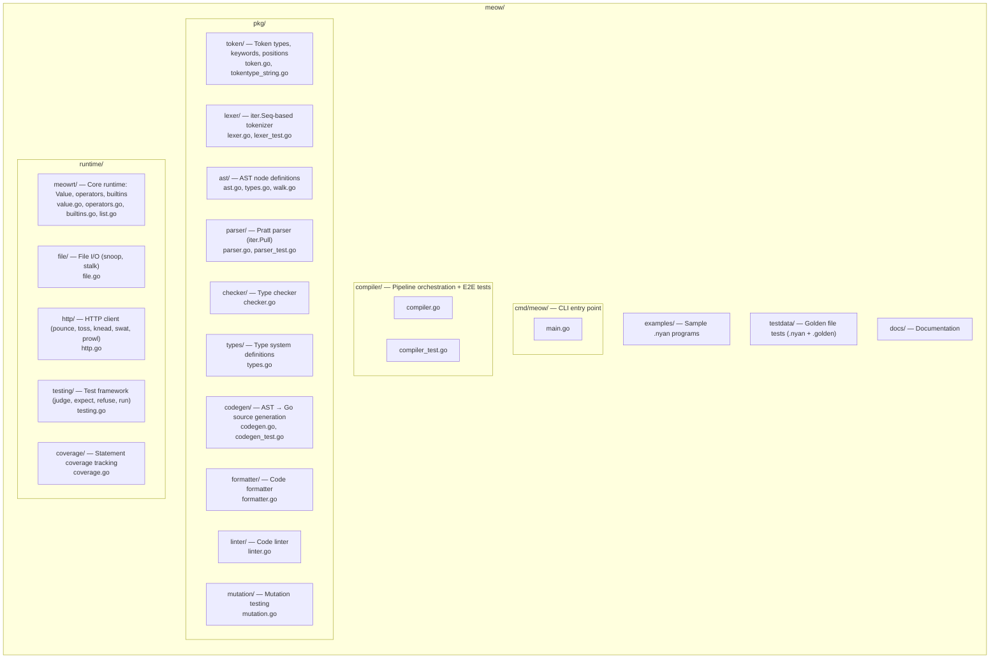
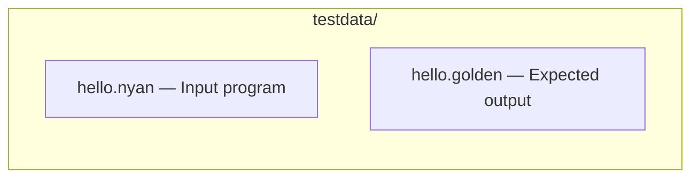

# Contributing to Meow

Thank you for your interest in contributing to the Meow programming language! This guide covers everything you need to know to get started.

## Development Environment Setup

### Prerequisites

- **Go 1.26+** — required (see `go.mod`)
- **stringer** — for code generation of token type names

```bash
# Install stringer
go install golang.org/x/tools/cmd/stringer@latest
```

### Clone and Build

```bash
git clone https://github.com/135yshr/meow.git
cd meow
go build ./cmd/meow
```

### Run Tests

```bash
go test ./...
```

## Build and Run

```bash
# Build the compiler
go build ./cmd/meow

# Run a .nyan program
go run ./cmd/meow run examples/hello.nyan

# Show transpiled Go code
go run ./cmd/meow transpile examples/hello.nyan

# Run tests
go test ./...

# Run tests verbose
go test ./... -v

# Static analysis
go vet ./...

# Update golden files (required when changing compiler output)
go test ./compiler/ -update

# Regenerate stringer output (after changing token types)
go generate ./...
```

## Project Structure


```mermaid
flowchart LR
    subgraph meow[" meow/ "]
        direction TB
        subgraph cmd["cmd/meow/ — CLI entry point"]
            cmd_main["main.go"]
        end
        subgraph compiler["compiler/ — Pipeline orchestration + E2E tests"]
            comp_go["compiler.go"]
            comp_test["compiler_test.go"]
        end
        subgraph pkg["pkg/"]
            token["token/ — Token types, keywords, positions<br/>token.go, tokentype_string.go"]
            lexer["lexer/ — iter.Seq-based tokenizer<br/>lexer.go, lexer_test.go"]
            ast["ast/ — AST node definitions<br/>ast.go, types.go, walk.go"]
            parser["parser/ — Pratt parser (iter.Pull)<br/>parser.go, parser_test.go"]
            checker["checker/ — Type checker<br/>checker.go"]
            types["types/ — Type system definitions<br/>types.go"]
            codegen["codegen/ — AST → Go source generation<br/>codegen.go, codegen_test.go"]
            formatter["formatter/ — Code formatter<br/>formatter.go"]
            linter["linter/ — Code linter<br/>linter.go"]
            mutation["mutation/ — Mutation testing<br/>mutation.go"]
        end
        subgraph runtime["runtime/"]
            meowrt["meowrt/ — Core runtime: Value, operators, builtins<br/>value.go, operators.go, builtins.go, list.go"]
            file["file/ — File I/O (snoop, stalk)<br/>file.go"]
            http["http/ — HTTP client (pounce, toss, knead, swat, prowl)<br/>http.go"]
            testing["testing/ — Test framework (judge, expect, refuse, run)<br/>testing.go"]
            coverage["coverage/ — Statement coverage tracking<br/>coverage.go"]
        end
        examples["examples/ — Sample .nyan programs"]
        testdata["testdata/ — Golden file tests (.nyan + .golden)"]
        docs["docs/ — Documentation"]
    end
```

## Adding a New Keyword

1. **Add the token** in `pkg/token/token.go`:
   - Add a constant in the `const` block (between `keywordsStart` and `keywordsEnd`)
   - Add an entry in the `keywords` map

2. **Regenerate stringer output**:
   ```bash
   go generate ./...
   ```

3. **Update the lexer** if needed (usually no changes — keywords are handled by `LookupIdent`)

4. **Update the parser** in `pkg/parser/parser.go`:
   - Add a case in `parseStmt()` or `parsePrefix()` as appropriate
   - Implement the parsing function

5. **Add AST node** in `pkg/ast/ast.go` if needed

6. **Update codegen** in `pkg/codegen/codegen.go`:
   - Handle the new AST node in `genStmt()` or `genExpr()`

7. **Add tests**:
   - Parser tests
   - Golden file tests in `testdata/`
   - Example in `examples/`

8. **Update documentation**:
   - `docs/reference.md` — add to keywords table
   - `docs/spec.md` — add grammar and semantics
   - Other docs as appropriate

## Adding a New Built-in Function

1. **Implement the function** in `runtime/meowrt/builtins.go` (or `list.go` for list operations):
   - Signature: `func Name(args ...Value) Value`
   - Use `"Hiss! ... , nya~"` for error messages

2. **Register in codegen** — add a case in `pkg/codegen/codegen.go`:
   - In `genCall()`, map the Meow name to the Go function name
   - In `genTypedCall()` if needed for typed mode

3. **Add tests**:
   - Unit tests for the runtime function
   - Integration tests (golden files)

4. **Update documentation**:
   - `docs/stdlib.md` — add function documentation
   - `docs/reference.md` — add to built-in functions table

## Adding a New Standard Library Package

1. **Create the package** at `runtime/<name>/`:
   - All public functions have signature `func Name(args ...meowrt.Value) meowrt.Value`
   - Use `"Hiss! ... , nya~"` for errors

2. **Register in codegen** — add entry to the `stdPackages` map in `pkg/codegen/codegen.go`:
   ```go
   var stdPackages = map[string]string{
       "file":    "github.com/135yshr/meow/runtime/file",
       "http":    "github.com/135yshr/meow/runtime/http",
       "testing": "github.com/135yshr/meow/runtime/testing",
       "mypackage": "github.com/135yshr/meow/runtime/mypackage",  // new
   }
   ```

3. The existing `genMemberCall` handles routing automatically — no other codegen changes needed

4. Users will write:
   ```meow
   nab "mypackage"
   mypackage.my_func("arg")
   ```

5. **Add tests**:
   - Unit tests in `runtime/<name>/<name>_test.go`
   - Integration test with `nab`

6. **Update documentation**:
   - `docs/stdlib.md` — add package section
   - `docs/reference.md` — mention the package

## Adding a Lint Rule

1. **Implement the rule** in `pkg/linter/linter.go`

2. **Add tests** for the new rule

3. **Update documentation** — mention the rule in `docs/effective-meow.md`

## Testing Conventions

### Golden File Tests

Located in `testdata/` with `.nyan` input and `.golden` expected output:


```mermaid
flowchart LR
    subgraph testdata["testdata/"]
        nyan["hello.nyan — Input program"]
        golden["hello.golden — Expected output"]
    end
```

Run golden tests:
```bash
go test ./compiler/
```

Update golden files when output changes:
```bash
go test ./compiler/ -update
```

### Unit Tests

Standard Go `_test.go` files in each package. Follow Go testing conventions:

```go
func TestSomething(t *testing.T) {
    // ...
}
```

### HTTP Tests

Use `httptest.NewServer` for local testing (see `runtime/http/http_test.go`).

### Panic Tests

Use `defer func() { recover() }()` to test `Hiss!` error paths:

```go
func TestHissOnInvalidInput(t *testing.T) {
    defer func() {
        if r := recover(); r == nil {
            t.Error("expected panic")
        }
    }()
    SomeFunction(invalidInput)
}
```

## Commit Style

We use [gitmoji](https://gitmoji.dev/) prefixes in commit messages:

| Prefix | Usage |
|--------|-------|
| `✨ feat:` | New feature |
| `🐛 fix:` | Bug fix |
| `♻️ refactor:` | Code refactoring |
| `📝 docs:` | Documentation |
| `✅ test:` | Adding/updating tests |
| `🎨 style:` | Code style/formatting |
| `⬆️ chore:` | Dependencies/tooling |
| `🚀 ci:` | CI/CD changes |
| `🔧 config:` | Configuration changes |

Commit messages are in **English**.

Example:
```text
✨ feat: Add string interpolation support
```

## PR Process

1. Fork the repository
2. Create a feature branch: `git checkout -b feat/my-feature`
3. Make your changes with tests
4. Ensure all tests pass: `go test ./...`
5. Ensure code passes vet: `go vet ./...`
6. Commit with gitmoji prefix
7. Push and open a Pull Request

### PR Checklist

- [ ] Tests pass (`go test ./...`)
- [ ] No vet warnings (`go vet ./...`)
- [ ] Golden files updated if output changed (`go test ./compiler/ -update`)
- [ ] Stringer regenerated if tokens changed (`go generate ./...`)
- [ ] Documentation updated for new features
- [ ] Commit messages use gitmoji prefix

## Release Process

Releases are cut automatically. `.github/workflows/auto-release.yml` runs
semantic-release on every push to `main`: it reads the gitmoji prefixes since
the last tag, decides the version, writes `CHANGELOG.md`, tags `vX.Y.Z`, and
GoReleaser publishes the binaries. Nothing is done by hand there.

### Write a blog post for every release

**Every `vX.Y.Z` tag gets one post under `website/content/blog/`.** The site is
crawled on how often it changes, and a documentation site that only ever edits
pages in place gives a search engine nothing new to fetch. One post per release
keeps `sitemap.xml` gaining URLs, and each post carries a `date`, which
`website/layouts/partials/jsonld.html` emits as `datePublished`.

Write the post in the same PR as the release, or in a follow-up PR straight
after the tag is pushed — before the next release, not in a batch later.

**File name** — the tag with its dots replaced by hyphens, so `v0.21.0`
becomes `website/content/blog/v0-21-0.md`. The URL is then
`https://meow.oreha.dev/blog/v0-21-0/`.

**Front matter** — three keys, matching the rest of the site:

```yaml
---
title: "Meow Programming Language v0.21.0: A Member Read as Well as Called"
description: "Meow Programming Language v0.21.0 makes a member read without () a value of its own, so a .nyan method can be piped into, mapped over a list, or bound to a name."
date: 2026-08-19T22:47:43Z
---
```

- `title` — `Meow Programming Language vX.Y.Z: <what changed>`. The second half
  is the change in the words a user would use, not the commit subject.
- `description` — one sentence, under about 160 characters, naming the version
  and what it does. This is the meta description and the card text on
  `/blog/`.
- `date` — the **real release timestamp**, in RFC 3339. Take it from
  `gh release view vX.Y.Z --json publishedAt` or
  `git log -1 --format=%aI vX.Y.Z`. Do not round to the day: releases often
  land several to a day, and the time is what orders them on the index. Do not
  set `weight`; posts sort newest-first by date, after the pinned
  `release-notes.md`.

**Body** — in this order:

1. One line saying when it was released and what it is about.
2. The problem, with the code that showed it and the error it gave.
3. What it does now, with a **runnable `.nyan` example**. Run it before you
   publish it — `go run ./cmd/meow run example.nyan` — and paste the real
   output as comments. Examples in `examples/` and `testdata/` are already
   covered by tests and make good starting points.
4. Anything removed, loosened, or now caught somewhere else.
5. **Upgrading** — what a program has to change, or "nothing to change" when
   that is true, followed by `brew upgrade meow` and
   `go install github.com/135yshr/meow/cmd/meow@vX.Y.Z`.

Link to the neighbouring releases with `` when
one release builds on another, and to `doc/spec.md` or `doc/reference.md` for
the rule itself.

**Where to source it**

| Want | Look at |
|---|---|
| What is in the release | `git log --oneline vX.Y.(Z-1)..vX.Y.Z` |
| The summary already written | `CHANGELOG.md` |
| The problem, the before/after, the error text | the merged PR body — `gh pr view <n>` |
| A verified example | the PR's golden fixture in `testdata/`, or `examples/` |
| The release timestamp | `gh release list`, `gh release view vX.Y.Z` |

A patch release with something to say gets its own post; a release that only
bumps a dependency can be folded into the next one rather than padded out. The
point is a real page a reader gains something from, not a page per tag for its
own sake.

Between releases, aim for roughly one non-release post a month — a language
feature in depth, `pose`/`groom`, how the two backends stay in step — so the
site keeps moving when the compiler does not.

## Dependencies

Meow has **zero runtime dependencies** — standard library only. Development tools like `stringer` are allowed as build-time dependencies. Please do not introduce third-party runtime packages.
