# Contributing to Meow

Thank you for your interest in contributing to the Meow programming language! This guide covers everything you need to know to get started.

## Development Environment Setup

### Prerequisites

- **Go 1.26+** — required for `iter` package support
- **stringer** — for code generation of token type names

```bash
# Install stringer
go install golang.org/x/tools/cmd/stringer@latest
```

### Clone and Build

```bash
git clone https://github.com/135yshr/meow.git
cd meow
go build ./cmd/meow
```

### Run Tests

```bash
go test ./...
```

## Build and Run

```bash
# Build the compiler
go build ./cmd/meow

# Run a .nyan program
go run ./cmd/meow run examples/hello.nyan

# Show transpiled Go code
go run ./cmd/meow transpile examples/hello.nyan

# Run tests
go test ./...

# Run tests verbose
go test ./... -v

# Static analysis
go vet ./...

# Update golden files (required when changing compiler output)
go test ./compiler/ -update

# Regenerate stringer output (after changing token types)
go generate ./...
```

## Project Structure

```mermaid
flowchart LR
    subgraph meow[" meow/ "]
        direction TB
        subgraph cmd["cmd/meow/ — CLI entry point"]
            cmd_main["main.go"]
        end
        subgraph compiler["compiler/ — Pipeline orchestration + E2E tests"]
            comp_go["compiler.go"]
            comp_test["compiler_test.go"]
        end
        subgraph pkg["pkg/"]
            token["token/ — Token types, keywords, positions<br/>token.go, tokentype_string.go"]
            lexer["lexer/ — iter.Seq-based tokenizer<br/>lexer.go, lexer_test.go"]
            ast["ast/ — AST node definitions<br/>ast.go, types.go, walk.go"]
            parser["parser/ — Pratt parser (iter.Pull)<br/>parser.go, parser_test.go"]
            checker["checker/ — Type checker<br/>checker.go"]
            types["types/ — Type system definitions<br/>types.go"]
            codegen["codegen/ — AST → Go source generation<br/>codegen.go, codegen_test.go"]
            formatter["formatter/ — Code formatter<br/>formatter.go"]
            linter["linter/ — Code linter<br/>linter.go"]
            mutation["mutation/ — Mutation testing<br/>mutation.go"]
        end
        subgraph runtime["runtime/"]
            meowrt["meowrt/ — Core runtime: Value, operators, builtins<br/>value.go, operators.go, builtins.go, list.go"]
            file["file/ — File I/O (snoop, stalk)<br/>file.go"]
            http["http/ — HTTP client (pounce, toss, knead, swat, prowl)<br/>http.go"]
            testing["testing/ — Test framework (judge, expect, refuse, run)<br/>testing.go"]
            coverage["coverage/ — Statement coverage tracking<br/>coverage.go"]
        end
        examples["examples/ — Sample .nyan programs"]
        testdata["testdata/ — Golden file tests (.nyan + .golden)"]
        docs["docs/ — Documentation"]
    end
```



## Adding a New Keyword

1. **Add the token** in `pkg/token/token.go`:
   - Add a constant in the `const` block (between `keywordsStart` and `keywordsEnd`)
   - Add an entry in the `keywords` map

2. **Regenerate stringer output**:
   ```bash
   go generate ./...
   ```

3. **Update the lexer** if needed (usually no changes — keywords are handled by `LookupIdent`)

4. **Update the parser** in `pkg/parser/parser.go`:
   - Add a case in `parseStmt()` or `parsePrefix()` as appropriate
   - Implement the parsing function

5. **Add AST node** in `pkg/ast/ast.go` if needed

6. **Update codegen** in `pkg/codegen/codegen.go`:
   - Handle the new AST node in `genStmt()` or `genExpr()`

7. **Add tests**:
   - Parser tests
   - Golden file tests in `testdata/`
   - Example in `examples/`

8. **Update documentation**:
   - `docs/reference.md` — add to keywords table
   - `docs/spec.md` — add grammar and semantics
   - Other docs as appropriate

## Adding a New Built-in Function

1. **Implement the function** in `runtime/meowrt/builtins.go` (or `list.go` for list operations):
   - Signature: `func Name(args ...Value) Value`
   - Use `"Hiss! ... , nya~"` for error messages

2. **Register in codegen** — add a case in `pkg/codegen/codegen.go`:
   - In `genCall()`, map the Meow name to the Go function name
   - In `genTypedCall()` if needed for typed mode

3. **Add tests**:
   - Unit tests for the runtime function
   - Integration tests (golden files)

4. **Update documentation**:
   - `docs/stdlib.md` — add function documentation
   - `docs/reference.md` — add to built-in functions table

## Adding a New Standard Library Package

1. **Create the package** at `runtime/<name>/`:
   - All public functions have signature `func Name(args ...meowrt.Value) meowrt.Value`
   - Use `"Hiss! ... , nya~"` for errors

2. **Register in codegen** — add entry to the `stdPackages` map in `pkg/codegen/codegen.go`:
   ```go
   var stdPackages = map[string]string{
       "file":    "github.com/135yshr/meow/runtime/file",
       "http":    "github.com/135yshr/meow/runtime/http",
       "testing": "github.com/135yshr/meow/runtime/testing",
       "mypackage": "github.com/135yshr/meow/runtime/mypackage",  // new
   }
   ```

3. The existing `genMemberCall` handles routing automatically — no other codegen changes needed

4. Users will write:
   ```meow
   fetch "mypackage"
   mypackage.my_func("arg")
   ```

5. **Add tests**:
   - Unit tests in `runtime/<name>/<name>_test.go`
   - Integration test with `fetch`

6. **Update documentation**:
   - `docs/stdlib.md` — add package section
   - `docs/reference.md` — mention the package

## Adding a Lint Rule

1. **Implement the rule** in `pkg/linter/linter.go`

2. **Add tests** for the new rule

3. **Update documentation** — mention the rule in `docs/effective-meow.md`

## Testing Conventions

### Golden File Tests

Located in `testdata/` with `.nyan` input and `.golden` expected output:

```mermaid
flowchart LR
    subgraph testdata["testdata/"]
        nyan["hello.nyan — Input program"]
        golden["hello.golden — Expected output"]
    end
```



Run golden tests:
```bash
go test ./compiler/
```

Update golden files when output changes:
```bash
go test ./compiler/ -update
```

### Unit Tests

Standard Go `_test.go` files in each package. Follow Go testing conventions:

```go
func TestSomething(t *testing.T) {
    // ...
}
```

### HTTP Tests

Use `httptest.NewServer` for local testing (see `runtime/http/http_test.go`).

### Panic Tests

Use `defer func() { recover() }()` to test `Hiss!` error paths:

```go
func TestHissOnInvalidInput(t *testing.T) {
    defer func() {
        if r := recover(); r == nil {
            t.Error("expected panic")
        }
    }()
    SomeFunction(invalidInput)
}
```

## Commit Style

We use [gitmoji](https://gitmoji.dev/) prefixes in commit messages:

| Prefix | Usage |
|--------|-------|
| `✨ feat:` | New feature |
| `🐛 fix:` | Bug fix |
| `♻️ refactor:` | Code refactoring |
| `📝 docs:` | Documentation |
| `✅ test:` | Adding/updating tests |
| `🎨 style:` | Code style/formatting |
| `⬆️ chore:` | Dependencies/tooling |
| `🚀 ci:` | CI/CD changes |
| `🔧 fix:` | Configuration changes |

Commit messages are in **English**.

Example:
```text
✨ feat: Add string interpolation support
```

## PR Process

1. Fork the repository
2. Create a feature branch: `git checkout -b feat/my-feature`
3. Make your changes with tests
4. Ensure all tests pass: `go test ./...`
5. Ensure code passes vet: `go vet ./...`
6. Commit with gitmoji prefix
7. Push and open a Pull Request

### PR Checklist

- [ ] Tests pass (`go test ./...`)
- [ ] No vet warnings (`go vet ./...`)
- [ ] Golden files updated if output changed (`go test ./compiler/ -update`)
- [ ] Stringer regenerated if tokens changed (`go generate ./...`)
- [ ] Documentation updated for new features
- [ ] Commit messages use gitmoji prefix

## Dependencies

Meow has **zero runtime dependencies** — standard library only. Development tools like `stringer` are allowed as build-time dependencies. Please do not introduce third-party runtime packages.
