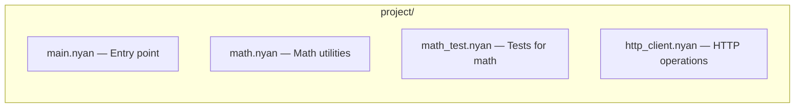

# Effective Meow

Idiomatic patterns and conventions for writing clean, consistent Meow code.

## Placeholder Names

Every language has its go-to stand-in names — the world at large reaches for
`foo`, `bar`, and `baz`. In Meow, we have our own cast of characters:

| Name | Role |
|------|------|
| **Nyantyu** | The first cat on the scene — your default placeholder |
| **Tyako** | The second — shows up when one name isn't enough |
| **Tyomusuke** | The third — for when the gang's all here |

Use them in examples, tests, and documentation whenever you need throwaway
names. Keeping these consistent makes `.nyan` code feel at home everywhere
in the project.

```nyan
kitty Cat {
  name: string
  age: int
}

nyan nyantyu = Cat("Nyantyu", 3)
nyan tyako = Cat("Tyako", 5)
nyan tyomusuke = Cat("Tyomusuke", 2)

nya(nyantyu)
nya(tyako)
nya(tyomusuke)
```

## Naming Conventions

All user-facing identifiers in Meow use **snake_case**. This is enforced by `meow lint` with the `snake-case` rule.

```meow
# Good
nyan max_value int = 100
meow find_max(nums list) int { ... }
meow test_basic_pipe() { ... }

# Bad — will trigger lint warning
nyan maxValue int = 100
meow findMax(nums list) int { ... }
```

- **Variables**: `snake_case` — `my_cat`, `total_count`, `is_valid`
- **Functions**: `snake_case` — `find_max`, `check_age`, `parse_input`
- **Test functions**: `test_` prefix — `test_addition`, `test_error_handling`
- **Catwalk functions**: `catwalk_` prefix — `catwalk_hello`, `catwalk_output`
- **Kitty types**: `PascalCase` — `Cat`, `Point`, `HttpResponse` (they are type names, like Go structs)
- **Keywords**: single lowercase words — `nyan`, `meow`, `sniff`, `purr`

## Type Annotations

Add type annotations to function parameters and return values. This enables compile-time checking and generates faster native Go code instead of boxed `meow.Value` operations.

```meow
# Good — fully typed, generates native Go arithmetic
meow add(a int, b int) int {
  bring a + b
}

# Works but slower — generates boxed meow.Value operations
meow add(a, b) {
  bring a + b
}
```

For variables, type annotations are recommended when the type isn't obvious from the initial value:

```meow
# Type is clear from the literal — annotation optional
nyan name = "Nyantyu"
nyan count = 0

# Type clarifies intent
nyan max_retries int = 3
nyan threshold float = 0.95
```

Use Go-style grouped types to reduce repetition:

```meow
# Instead of this
meow distance(x1 int, y1 int, x2 int, y2 int) float { ... }

# Write this
meow distance(x1, y1, x2, y2 int) float { ... }
```

## Error Handling Patterns

Meow provides three error-handling mechanisms. Choose the right one for each situation:

### `~>` — Use for inline recovery with a default value

Best when you have a sensible fallback:

```meow
nyan config = file.snoop("config.txt") ~> "default config"
nyan port = to_int(port_str) ~> 8080
```

### `~>` with handler — Use when you need to inspect the error

```meow
nyan result = http.pounce(url) ~> paw(err) {
  nya("Request failed:", err)
  "{}"
}
```

### `gag` / `is_furball` — Use for complex error logic

Best when you need to branch on success/failure:

```meow
nyan result = gag(paw() { parse_data(input) })
sniff (is_furball(result)) {
  nya("Parse error:", result)
  bring catnap
}
# continue with result
```

### `hiss` — Use to signal unrecoverable errors

```meow
meow require_positive(n int) int {
  sniff (n <= 0) {
    hiss("expected positive number, got:", to_string(n))
  }
  bring n
}
```

## Pipe Operator Idioms

The pipe `|=|` makes data transformation chains readable. Use it to express left-to-right data flow:

### List processing chains

```meow
nyan result = [1, 2, 3, 4, 5, 6, 7, 8, 9, 10]
  |=| picky(paw(x) { x % 2 == 0 })
  |=| lick(paw(x) { x * x })
  |=| curl(0, paw(acc, x) { acc + x })

nya(result)   # => 220 (sum of squares of even numbers)
```

### File processing with pipe

```meow
fetch "file"

file.stalk("input.txt")
  |=| picky(paw(line) { len(line) > 0 })
  |=| lick(paw(line) { "=> " + line })
  |=| nya
```

### Print with pipe

`nya` works naturally at the end of a pipe:

```meow
[1, 2, 3] |=| lick(paw(x) { x * 2 }) |=| nya
# => [2, 4, 6]
```

## Pattern Matching Best Practices

### Always include a wildcard

Every `peek` expression should include a `_` wildcard arm as the last case. This ensures all values are handled:

```meow
# Good
nyan label = peek(score) {
  0 => "zero",
  1..50 => "low",
  51..100 => "high",
  _ => "unknown"
}

# Risky — no wildcard means unmatched values return catnap
nyan label = peek(score) {
  0 => "zero",
  1..50 => "low"
}
```

### Use ranges for numeric classification

```meow
meow grade(score int) string {
  bring peek(score) {
    0..59 => "F",
    60..69 => "D",
    70..79 => "C",
    80..89 => "B",
    90..100 => "A",
    _ => "invalid"
  }
}
```

## Kitty Design Patterns

### Use typed fields

Always annotate kitty fields with types:

```meow
kitty Cat {
  name: string
  age: int
}
```

### Constructor pattern

Kitty types get an automatic constructor. Pass field values in order:

```meow
nyan nyantyu = Cat("Nyantyu", 3)
```

### Using kitty with functions

```meow
kitty Rectangle {
  width: float
  height: float
}

meow area(rect) {
  bring to_float(rect.width) * to_float(rect.height)
}

meow describe(rect) {
  nya(to_string(rect.width) + "x" + to_string(rect.height)
    + " = " + to_string(area(rect)))
}

nyan r = Rectangle(4.0, 5.0)
describe(r)   # => 4x5 = 20
```

## Type Alias and Newtype Patterns

### Use `breed` for domain vocabulary

`breed` makes code self-documenting without runtime cost. Use it to name domain concepts:

```meow
breed Meters = float
breed Seconds = float
breed MetersPerSecond = float

meow speed(distance Meters, time Seconds) MetersPerSecond {
  bring distance / time
}
```

Since `breed` is transparent, you can still pass plain `float` values where `Meters` is expected.

### Use `collar` to prevent mix-ups

When two values share the same underlying type but must never be confused, use `collar`:

```meow
collar UserId = int
collar ProductId = int

meow fetch_user(id UserId) { ... }

nyan user_id = UserId(42)
nyan product_id = ProductId(99)

fetch_user(user_id)       # correct
# fetch_user(product_id)  # type error — ProductId is not UserId
```

### Naming conventions for type declarations

- **breed/collar names**: `PascalCase` — `UserId`, `Nickname`, `Temperature` (like `kitty` types)
- **breed** for readable aliases: `breed Meters = float`
- **collar** for type-safe wrappers: `collar UserId = int`

### Unwrapping collar values

Access the inner value with `.value`:

```meow
collar Email = string
nyan email = Email("nyantyu@meow.cat")

# Use .value when you need the raw value
nya("Contact: " + email.value)
```

## Testing Patterns

### `test_` vs `catwalk_`

Use `test_` for logic assertions, `catwalk_` for output verification:

```meow
# test_ — checks return values and conditions
meow test_addition() {
  expect(1 + 1, 2)
  judge(10 > 5)
}

# catwalk_ — checks printed output
meow catwalk_greeting() {
  nya("Hello, World!")
}
# Output:
# Hello, World!
```

### Test organization

Group related assertions in a single test function:

```meow
meow test_string_operations() {
  expect(len("hello"), 5, "length")
  expect("a" + "b", "ab", "concatenation")
  judge("hello" == "hello", "equality")
  refuse("hello" == "world", "inequality")
}
```

### Testing error conditions

```meow
meow test_division_by_zero() {
  nyan result = gag(paw() { divide(10, 0) })
  judge(is_furball(result), "should produce furball")
}
```

### Fuzz testing

Functions with `fuzz_` prefix receive random inputs via `seed()`:

```meow
meow fuzz_addition(a int, b int) {
  nyan result = a + b
  judge(result - a == b, "addition identity")
}
```

Run with: `meow test -fuzz fuzz_file.nyan`

## Code Organization

### One concept per file

Keep `.nyan` files focused on a single module or concept:



### Use `fetch` for standard library

Declare imports at the top of the file:

```meow
fetch "file"
fetch "http"

# ... rest of code
```

### Keep functions small

Prefer many small, focused functions over large monolithic ones. Use descriptive names:

```meow
# Good
meow is_even(n int) bool { bring n % 2 == 0 }
meow square(n int) int { bring n * n }

nyan result = [1, 2, 3, 4, 5]
  |=| picky(is_even)
  |=| lick(square)

# Less readable
nyan result = picky([1, 2, 3, 4, 5], paw(x) { x % 2 == 0 })
result = lick(result, paw(x) { x * x })
```

## Formatting

Use `meow fmt` to auto-format your code:

```bash
meow fmt my_file.nyan
meow fmt .        # format all .nyan files in current directory
```

## Linting

Use `meow lint` to check for style issues:

```bash
meow lint my_file.nyan
meow lint .       # lint all .nyan files
```

Current lint rules:
- `snake-case` — identifiers must be snake_case
