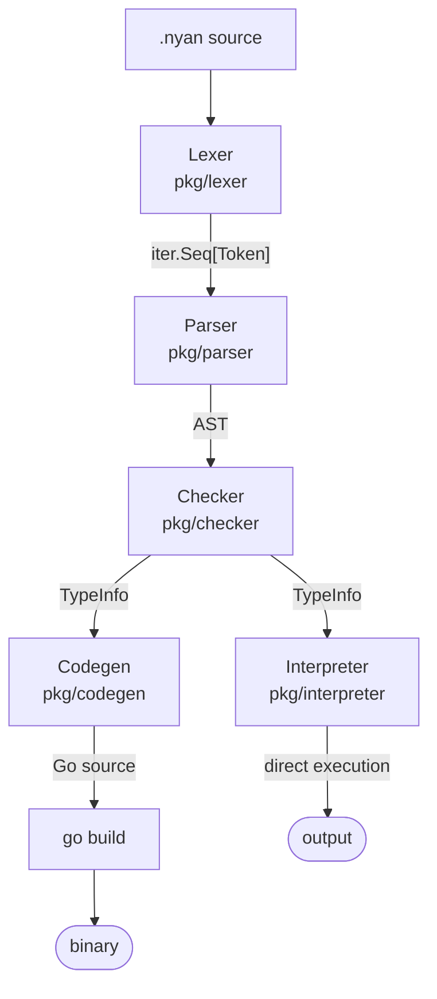

# Meow Compiler Internals

This document describes the internal architecture of the Meow compiler for contributors who want to understand or modify the compilation pipeline.

## Pipeline Overview



There are two execution paths from the AST:

**Compiler path** (CLI: `meow run`, `meow build`), orchestrated by `compiler/compiler.go`:
1. **Lexer** tokenizes `.nyan` source into a stream of tokens
2. **Parser** builds an AST from the token stream
3. **Checker** performs type checking and collects type information
4. **Codegen** transforms the AST into Go source code
5. **go build** compiles the Go source to a native binary

**Interpreter path** (Playground / WASM):
1. **Lexer**, **Parser**, and **Checker** are shared with the compiler path
2. **Interpreter** walks the AST directly, evaluating expressions and executing statements
3. Output is captured to an `io.Writer` (no `go build` required)

## Lexer (`pkg/lexer/`)

### Design

The lexer produces an `iter.Seq[Token]` — the push-based iterator from the standard library's `iter` package, which arrived in Go 1.23. (Meow's own toolchain requires Go 1.26, for unrelated reasons.) The lexer doesn't allocate a slice of all tokens upfront; instead, it yields tokens lazily as they're consumed.

### Token Emission

A `Lexer` is constructed over the source, and `Tokens()` hands back the sequence:

```go
func New(input, file string) *Lexer

func (l *Lexer) Tokens() iter.Seq[token.Token] {
    return func(yield func(token.Token) bool) {
        // scan characters, yield tokens
    }
}
```

### Scanning

The lexer operates character-by-character:

1. Skips whitespace (spaces, tabs, carriage returns)
2. Recognizes single/multi-character operators (`==`, `!=`, `|=|`, `~>`, `..`, `=>`)
3. Scans identifiers and looks them up in the keyword table (`token.LookupIdent`)
4. Scans numeric literals (integers and floats)
5. Scans string literals (double-quoted, with escape sequences)
6. Handles line comments (`#`) and block comments (`-~ ... ~-`)
7. Emits `NEWLINE` tokens as statement separators

### Position Tracking

Every token carries a `Position` with file name, 1-based line number, and column number.

## Parser (`pkg/parser/`)

### Design

The parser uses **Pratt parsing** (top-down operator precedence) for expressions, with recursive descent for statements. The token stream arrives as `iter.Seq[Token]`, which is converted to a pull-based iterator via `iter.Pull`:

```go
func New(tokens iter.Seq[token.Token]) *Parser {
    next, stop := iter.Pull(tokens)
    p := &Parser{next: next, stop: stop}
    p.advance()
    p.advance()
    return p
}
```

The parser maintains two tokens: `cur` (current) and `peek` (lookahead).

### Precedence Levels

```go
const (
    precNone  = iota
    precCatch // ~>
    precOr    // ||
    precAnd   // &&
    precEq    // == !=
    precCmp   // < > <= >=
    precPipe  // |=|
    precAdd   // + -
    precMul   // * / %
    precUnary // ! -
    precCall  // () []
)
```

### Expression Parsing

The core of Pratt parsing:

```go
func (p *Parser) parseExpr(minPrec int) ast.Expr {
    left := p.parsePostfix(p.parsePrefix())
    for {
        p.continueAcrossPipeLine(minPrec)
        prec := p.infixPrec(p.cur.Type)
        if prec <= minPrec {
            break
        }
        left = p.parseInfix(left, prec)  // Parse infix (binary, pipe, catch)
    }
    return left
}
```

Prefix parsers handle: literals, identifiers, `self`, unary operators, lambdas, lists, maps, match expressions, and grouped expressions `(...)`.

`parsePostfix` applies trailing index suffixes `[...]`. Calls `(...)` and member access `.name` are read by the prefix parser for identifiers (`parseIdentOrCall`), so they bind tighter than any infix operator.

Infix parsers handle: binary operators, pipe `|=|`, and catch `~>`.

### Statement Parsing

`parseStmt()` dispatches on the current token type:

| Token | Parser |
|-------|--------|
| `NYAN` | `parseVarStmt` |
| `MEOW` | `parseFuncStmt` |
| `TRILL` | `parsePureFuncStmt` |
| `BRING` | `parseReturnStmt` |
| `SNIFF` | `parseIfStmt` |
| `PURR` | `parsePurrStmt` |
| `BOLT` | inline — `ast.BoltStmt` |
| `SLINK` | inline — `ast.SlinkStmt` |
| `NAB` | `parseFetchStmt` |
| `KITTY` | `parseKittyStmt` |
| `BREED` | `parseBreedStmt` |
| `COLLAR` | `parseCollarStmt` |
| `POSE` | `parseTrickStmt` |
| `GROOM` | `parseLearnStmt` |
| other | `parseExprStmtOrAssign` |

`parsePurrStmt` produces either a `RangeStmt` (the counted, `a..b`, and string forms) or a `WhileStmt` (the conditional form).

### Newline Handling

Newlines are significant as statement terminators. The parser skips consecutive newlines and comments between statements via `skipNewlines()`. Inside a list literal `[...]` or a map literal `{...}`, newlines after the opening bracket, after each comma, and before the closing bracket are skipped, so those literals can be written down the page. An argument list `(...)` does not skip newlines.

One operator may lead a line. `continueAcrossPipeLine` drops a newline whose very next token is `|=|`, so a chain can be written a stage per line:

```meow
[1, 2, 3]
  |=| picky(even)
  |=| nya
```

The rule reaches exactly one token past the newline, so a blank line or a comment between two stages still ends the statement — and a `|=|` left at the head of a line then reports that directly rather than as "unexpected token".

## AST (`pkg/ast/`)

### Node Hierarchy

```mermaid
classDiagram
    class Node {
        <<interface>>
    }
    class Expr {
        <<interface>>
        produces a value
    }
    class Stmt {
        <<interface>>
        performs an action
    }
    class Pattern {
        <<interface>>
        for pattern matching
    }
    class TypeExpr {
        <<interface>>
        type annotations
    }

    Node <|-- Expr
    Node <|-- Stmt
    Node <|-- Pattern
    Node <|-- TypeExpr

    Expr <|-- IntLit
    Expr <|-- FloatLit
    Expr <|-- StringLit
    Expr <|-- BoolLit
    Expr <|-- NilLit
    Expr <|-- Ident
    Expr <|-- UnaryExpr
    Expr <|-- BinaryExpr
    Expr <|-- CallExpr
    Expr <|-- LambdaExpr
    Expr <|-- ListLit
    Expr <|-- MapLit
    Expr <|-- IndexExpr
    Expr <|-- PipeExpr
    Expr <|-- CatchExpr
    Expr <|-- MatchExpr
    Expr <|-- MemberExpr
    Expr <|-- SelfExpr

    Stmt <|-- VarStmt
    Stmt <|-- FuncStmt
    Stmt <|-- ReturnStmt
    Stmt <|-- IfStmt
    Stmt <|-- RangeStmt
    Stmt <|-- WhileStmt
    Stmt <|-- BoltStmt
    Stmt <|-- SlinkStmt
    Stmt <|-- FetchStmt
    Stmt <|-- KittyStmt
    Stmt <|-- BreedStmt
    Stmt <|-- CollarStmt
    Stmt <|-- TrickStmt
    Stmt <|-- LearnStmt
    Stmt <|-- ExprStmt

    Pattern <|-- LiteralPattern
    Pattern <|-- RangePattern
    Pattern <|-- WildcardPattern

    TypeExpr <|-- BasicType
    TypeExpr <|-- NamedType
```



### Key Nodes

- **PipeExpr**: `Left |=| Right` — desugared to a function call in codegen
- **CatchExpr**: `Left ~> Right` — desugared to `GagOr` in codegen
- **RangeStmt**: The three forms of `purr` that walk something — count (`Start=nil`), range (`Start!=nil`, with `Inclusive` for `a..b`), and string, where `End` holds the string and `IndexVar` the optional second variable
- **WhileStmt**: The conditional form `purr (cond) { ... }`
- **KittyStmt**: Defines struct types; collected before code generation so constructors can be generated

## Type Checker (`pkg/checker/`)

### Pre-Passes, Then Checking

`Check` walks the top-level statements five times before it checks anything:

1. **Top-level names**: Records the name of every top-level `nyan` binding, so a function written above a binding it reads can still name it
2. **Imports**: Records each `nab` under its effective name and reports two imports claiming the same name
3. **Declaration registration**: Registers `breed`, `collar`, `kitty` and `pose` names as placeholders whose underlying type is still `AnyType`, and records each top-level `meow`/`trill` signature in `FuncTypes`
4. **Collisions**: Reports a top-level definition that shadows an imported package
5. **Underlying types**: Now that every name exists, resolves what each `breed`, `collar`, `kitty` and `pose` actually stands for, so a declaration may refer forward to one written below it. A fixup follows, replacing a snapshot taken before the type it wrapped had itself been resolved — `breed A = B` resolved ahead of `breed B = int` holds a stale `B`

Only then does the third pass check the statements: verifying type annotations, checking calls, and recording every expression's type in `ExprTypes`.

### TypeInfo

The checker produces a `TypeInfo` struct passed to codegen (and, on the other path, to the interpreter):

```go
type TypeInfo struct {
    ExprTypes   map[ast.Expr]types.Type
    VarTypes    map[string]types.Type
    FuncTypes   map[string]types.FuncType
    KittyTypes  map[string]types.KittyType
    AliasTypes  map[string]types.AliasType
    CollarTypes map[string]types.CollarType
    TrickTypes  map[string]types.TrickType
    LearnImpls  map[string]map[string]types.FuncType // typeName → methodName → FuncType
    ImportNames map[string]string                    // effective name → package path
    FuncRefs    map[*ast.Ident]bool
}
```

`FuncRefs` records the identifier occurrences that reach a top-level function declaration rather than a local that took the name over. Which declaration a name reaches is settled in the scope it was written in and cannot be recovered from its type, so codegen reads the answer from here.

### Gradual Typing

The type system is gradual, but the gradualness is not "annotate whatever you like". A `meow` function is required to annotate every parameter:

```go
for _, p := range fn.Params {
    if p.TypeAnn == nil {
        c.addError(fn.Token.Pos, "Parameter %q of function %s must have a type annotation", p.Name, fn.Name)
    }
}
```

and to annotate its return type whenever its body contains a `bring`. Once it declares a return type, it must return on every path. The same rule holds for `groom` methods.

What stays gradual is everything else:

- `nyan` takes its type from the value bound to it when no annotation is written
- `paw` lambdas annotate nothing: unannotated parameters are `AnyType`, and the result type is inferred from the body (a block body with no trailing expression stays open, since `bring` may return from anywhere in it)
- The annotation you choose may itself be imprecise. `litter` is `ListType{Elem: AnyType}` and `basket` is `MapType{Val: AnyType}` — annotated, but saying nothing about what is inside

`AnyType` represents a dynamically-typed value, and `types.IsAny` is what the checker consults before comparing two types: a comparison with `AnyType` on either side is skipped rather than failed.

### Scope Stack

Variables are tracked in a scope stack. Function bodies push a new scope containing the parameters. The checker resolves variable references by walking up the scope chain.

## Codegen (`pkg/codegen/`)

### Value Boxing

In untyped mode, all values are boxed as `meow.Value`:

| Meow | Generated Go |
|------|-------------|
| `42` | `meow.NewInt(42)` |
| `3.14` | `meow.NewFloat(3.14)` |
| `"hello"` | `meow.NewString("hello")` |
| `yarn` | `meow.NewBool(true)` |
| `catnap` | `meow.NewNil()` |
| `[1, 2]` | `meow.NewList(meow.NewInt(1), meow.NewInt(2))` |

### Typed Code Generation

Being annotated is not enough to leave the boxed path. Codegen generates native Go only for the types that have a native Go counterpart, which `isNativeType` decides:

```go
func isNativeType(t types.Type) bool {
    switch t.(type) {
    case types.IntType, types.ByteType, types.FloatType, types.StringType, types.BoolType:
        return true
    case types.AliasType:
        return isNativeType(types.Unwrap(t))
    }
    return false
}
```

| Meow Type | Go Type |
|-----------|---------|
| `int` | `int64` |
| `byte` | `byte` |
| `float` | `float64` |
| `string` | `string` |
| `bool` | `bool` |
| a `breed` alias | whatever it unwraps to |

Everything else — `litter`, `basket`, `furball`, a `kitty`, a `collar`, and of course an unannotated parameter — is `meow.Value`.

`isFullyTypedFuncType` then applies that test to a whole signature: the return type and *every* parameter must be native. One `litter` parameter puts the entire function back on the boxed path, return type included:

```meow
meow total(xs litter) int { bring len(xs) }
```

```go
func total(xs meow.Value) meow.Value { ... }
```

The gate applies to top-level functions only. A `meow` written inside another is emitted by `genNestedFunc` as a `meow.NewFuncWithArity` closure, boxed like a lambda's body however it is annotated, so it can read the enclosing function's parameters through the same boxing an ordinary runtime call gets.

When a signature does pass, the typed path avoids boxing overhead:

```meow
meow add(a int, b int) int { bring a + b }
```

Generates:

```go
func add(a int64, b int64) int64 {
    __caller := meow.Where()
    _ = __caller
    meow.Here("add.nyan:2:3")
    return meow.Returning(__caller, (a + b))
}
```

(`Where`/`Here`/`Returning` are the position bookkeeping that lets a failure report the line it happened on; both backends make the same note in the same place.)

When typed functions are called from untyped contexts, values are unboxed at call sites (`unboxToNative` → `meow.AsInt`, `meow.AsString`, …) and re-boxed for the return value (`boxNativeCall` → `meow.NewInt`, …).

### Stdlib Import Resolution

The `stdPackages` map defines available packages:

```go
var stdPackages = map[string]string{
    "clock":   "github.com/135yshr/meow/runtime/clock",
    "env":     "github.com/135yshr/meow/runtime/env",
    "file":    "github.com/135yshr/meow/runtime/file",
    "http":    "github.com/135yshr/meow/runtime/http",
    "json":    "github.com/135yshr/meow/runtime/json",
    "random":  "github.com/135yshr/meow/runtime/random",
    "testing": "github.com/135yshr/meow/runtime/testing",
}
```

`nab "file"` registers the import, and member calls like `file.snoop(x)` are generated as `meow_file.Snoop(x)` — the function name is capitalized by `capitalizeFirst`.

`nab go "path"` is a separate map (`goImports`). It imports a Go package into the program being built, under a `go_` prefix rather than `meow_`, and its members go through the bridge in `runtime/meowrt/bridge.go`: `pkg.Thing` becomes `meow.FromGo(go_pkg.Thing)`, and `pkg.do(x)` becomes `meow.CallGo("pkg.do", go_pkg.Do, x)`.

### Pipe Desugaring

The pipe `|=|` is desugared to a function call:

```meow
x |=| f(y)    →    f(x, y)
x |=| f       →    f(x)
```

### Catch Desugaring

The catch `~>` is desugared to `GagOr`:

```meow
expr ~> fallback
```

Becomes:

```go
meow.GagOr(meow.NewFunc("~>", func(args ...meow.Value) meow.Value {
    return <expr>
}), <fallback>)
```

### Kitty (Struct) Handling

Kitty definitions are collected in a pre-pass (`collectKittyDefs`). They don't generate Go struct types — instead, they use the runtime `Kitty` value with dynamic field lookup:

```meow
Cat("Nyantyu", 3)
```

Generates:

```go
meow.NewKitty("Cat", []string{"name", "age"}, meow.NewString("Nyantyu"), meow.NewInt(3))
```

Field access `cat.name` generates `meow.GetMember(cat, "name")`, which resolves a field on a `Kitty`, a `groom` method registered for its type, or a member of a value held from Go — whichever the receiver turns out to be. A `Furball` receiver is returned unchanged, so a failure earlier in a chain is the answer to the whole chain.

### Test Mode

In test mode (`GenerateTest`), the codegen:
1. Auto-imports the testing package
2. Collects `test_` prefixed functions and wraps them with `meow_testing.Run()`
3. Collects `catwalk_` prefixed functions and wraps them with `meow_testing.Catwalk()`
4. Appends `meow_testing.Report()` at the end of `main()`

## Compiler Orchestration (`compiler/`)

The `Compiler` struct ties the pipeline together:

```go
func (c *Compiler) CompileToGo(source, filename string) (string, error) {
    l := lexer.New(source, filename)
    p := parser.New(l.Tokens())
    prog, errs := p.Parse()
    // ... error handling ...
    ch := checker.New()
    typeInfo, typeErrs := ch.Check(prog)
    // ... error handling ...
    gen := codegen.New()
    gen.SetTypeInfo(typeInfo)
    raw, err := gen.Generate(prog)
    // ...
    formatted, err := format.Source([]byte(raw))
    if err != nil {
        // If formatting fails, return raw code for debugging
        return raw, nil
    }
    return string(formatted), nil
}
```

`CompileTestToGo`, `CompileFuzzToGo` and `RunMutationTest` follow the same shape with a different `codegen` entry point; each lexes the source again rather than reusing a spent iterator.

For `Build` and `Run`, the compiler:
1. Creates a temporary directory
2. Writes a `go.mod` and `main.go` with the generated code
3. Fetches the versions any `nab go` pinned, then runs `go mod tidy`
4. Runs `go build` in the temp directory
5. Copies or executes the resulting binary

## Runtime (`runtime/meowrt/`)

### Value Interface

All Meow values implement:

```go
type Value interface {
    Type() string     // "Int", "Float", "String", "Bool", etc.
    String() string   // String representation
    IsTruthy() bool   // Truthiness for conditions
}
```

### Concrete Types

- `Int` — wraps `int64`
- `Byte` — wraps `byte`
- `Float` — wraps `float64`
- `String` — wraps `string`
- `Bool` — wraps `bool`
- `NilValue` — nil, printed as `catnap`
- `Func` — wraps a Go function `func(args ...Value) Value`, with an `Arity` (`-1` = variadic, no currying)
- `Furball` — error value with `Message string` and a `Handled` flag
- `List` — wraps `[]Value` with helper methods
- `Map` — wraps `map[string]Value`
- `Kitty` — dynamic struct with `TypeName`, `FieldNames`, `Fields map[string]Value`
- `Opaque` — a Go value Meow has no shape for, carried so it can be passed back into the next call

`List` and `Map` also embed `origin`, remembering the Go value they were read out of, so a record read field by field is still passable whole.

### Operator Dispatch

Operators in `operators.go` use type switches to dispatch on operand types. All arithmetic requires same-type operands. Each operator first calls `propagate`, which returns the first `Furball` among its arguments, so a failure short-circuits without a panic. A type mismatch returns a new `Furball`:

```go
return &Furball{Message: fmt.Sprintf("Hiss! Cannot add %s and %s, nya~", a.Type(), b.Type())}
```

### Error Convention

A runtime error is a **value**, not a panic: a `*Furball` whose `Message` reads `"Hiss! <message>, nya~"`. It propagates through operators, builtins and `GetMember`, and generated code short-circuits on it statement by statement.

Panics are the exception, raised only where a value cannot be carried any further:

- `AsInt`, `AsString` and the rest of the unboxing helpers panic with the Hiss message rather than hand back a silent zero on the native path
- `Propagate` raises a statement's discarded `Furball` inside a fully typed function, which has no `meow.Value` to return it as

Both are caught again at the boundary: `gag` (and so `~>`) defers a `recover` that turns the panic back into a handled `Furball`. `ScramSignal` is deliberately re-raised — a program asking to end is not a failure to be caught.

Test assertion failures are `*meowrt.Furball` values too, built by `assertionFailure` and inspected by `Run`. (`runtime/testing` still declares a `testFailure` type for `recover()` compatibility, but nothing raises it any more.)

### Method Registry

`tricks.go` maintains a package-level method registry for `groom` method dispatch:

```go
var (
    methodRegistry   = map[string]map[string]func(...Value) Value{}
    methodRegistryMu sync.RWMutex
)
```

- `RegisterMethod(typeName, methodName, fn)` — registers a method
- `LookupMethod(typeName, methodName)` — looks up a method
- `DispatchMethod(obj, methodName, args...)` — calls a method on a `Kitty` value
- `ClearMethods()` — clears all registered methods (used by the interpreter between runs)

## Interpreter (`pkg/interpreter/`)

The interpreter provides an alternative execution path that walks the AST directly, without generating Go source or invoking `go build`. It is used by the WASM-based Playground to run `.nyan` code in the browser.

### Why an Interpreter?

The compiler pipeline requires `go build`, which cannot run in a browser. The interpreter reuses the existing Lexer, Parser, Checker, and `runtime/meowrt` packages, replacing only the Codegen + `go build` step with direct AST evaluation.

### Architecture

```go
type Interpreter struct {
    globals    *Environment      // top-level scope
    typeInfo   *checker.TypeInfo // optional type info from checker
    output     io.Writer         // nya() output destination
    kittyDefs  map[string]*ast.KittyStmt
    collarDefs map[string]*ast.CollarStmt
    funcDefs   map[string]*ast.FuncStmt
    stepCount  int64
    stepLimit  int64             // infinite loop protection (default 10M)
    exitCode   int               // the status scram asked to end with
}
```

### Environment (Scope Chain)

Variable bindings are managed by a linked list of `Environment` scopes:

```go
type Environment struct {
    vars   map[string]meowrt.Value
    parent *Environment
}
```

- `Define(name, val)` — bind in current scope
- `Set(name, val)` — update existing binding (walks up chain, panics if not found)
- `Get(name)` — lookup (walks up chain, panics if not found)
- `Has(name)` — report whether the chain defines the name
- `Child()` — create child scope

### Two-Pass Execution

Like the codegen, the interpreter uses a two-pass approach:

1. **Pass 1 (Declaration collection)**: Records `KittyStmt` and `CollarStmt` definitions, registers `FuncStmt` in the globals, and installs `LearnStmt` methods in the registry. `BreedStmt` and `TrickStmt` are type-level and need nothing at runtime
2. **Pass 2 (Execution)**: Runs all other top-level statements sequentially

`Run` also calls `meowrt.ClearMethods()` and resets the step count, the exit code and the recorded position first, since the playground runs one program after another in the same process.

### Return Signal

`bring` (return) is implemented via `panic(returnSignal{Value: val})`. Each function call wraps its body in a `defer/recover` block that catches `returnSignal` and extracts the return value. Other panics (e.g., `Hiss!` errors) propagate normally.

### Output Capture

`meowrt.Nya` writes to `fmt.Print` (stdout), which cannot be captured in the interpreter. Instead, the interpreter implements its own `builtinNya` that writes to `interp.output` (`io.Writer`). The logic is identical to `meowrt.Nya`.

### Step Limit

To prevent infinite loops (critical in the browser), every call to `evalExpr` and `execStmt` increments a step counter. When `stepLimit` is exceeded, a `stepLimitExceeded` panic is raised and caught by `RunSafe`.

### Runtime Reuse

The interpreter reuses `runtime/meowrt` extensively:

| Category | Reused Functions |
|----------|-----------------|
| Values | `NewInt`, `NewFloat`, `NewString`, `NewBool`, `NewNil`, `NewFunc`, `NewList`, `NewMap`, `NewKitty` |
| Operators | `Add`, `Sub`, `Mul`, `Div`, `Mod`, `Negate`, `Not`, `Equal`, `NotEqual`, `LessThan`, `GreaterThan`, `LessEqual`, `GreaterEqual` |
| Builtins | `Hiss`, `Gag`, `GagOr`, `IsFurball`, `ToInt`, `ToFloat`, `ToString`, `Len`, `Call` |
| Lists | `Lick`, `Picky`, `Curl`, `Head`, `Tail`, `Append` |
| Methods | `RegisterMethod`, `LookupMethod`, `DispatchMethod`, `ClearMethods` |
| Matching | `MatchValue`, `MatchRange` |

### Limitations

- `nab` is not supported in either form. Meow's own packages want OS-level APIs the browser does not have, and `nab go` wants a Go toolchain, which the browser does not have either. Reaching one raises `Hiss! nab "..." is not supported in the playground, nya~`, naming the import the way the program wrote it
- Method registry is global — `ClearMethods()` is called at the start of each `Run` to avoid accumulation across invocations

## WASM Playground (`cmd/playground/`, `playground/`)

The Playground compiles the interpreter pipeline to WebAssembly, allowing `.nyan` code to run in the browser.

### WASM Entry Point (`cmd/playground/main_wasm.go`)

Exports a single JavaScript function `runMeow(source)` that:
1. Lexes and parses the source
2. Runs the checker
3. Executes via the interpreter
4. Returns a JSON string `{output, error}`

Build: `GOOS=js GOARCH=wasm go build -o playground/meow.wasm ./cmd/playground/`

### Frontend (`playground/`)

| File | Purpose |
|------|---------|
| `index.html` | Editor, Run button, output panel, example selector |
| `style.css` | Dark theme with cat-themed accents |
| `app.js` | WASM loading, `runMeow()` invocation, Ctrl+Enter shortcut |
| `examples.js` | Sample programs (Hello World, Fibonacci, FizzBuzz, etc.) |
| `consent.css`, `consent.js` | Analytics consent banner; analytics stay denied until accepted |
| `wasm_exec.js` | Go WASM runtime (copied from `$(go env GOROOT)/lib/wasm/wasm_exec.js`) |
| `meow.wasm` | Compiled WASM binary, built by `make wasm` |
