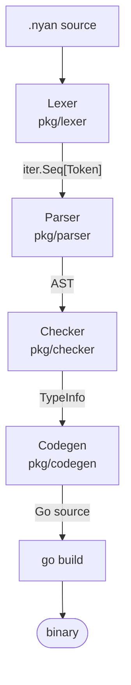

This document describes the internal architecture of the Meow compiler for contributors who want to understand or modify the compilation pipeline.

## Pipeline Overview



The pipeline is orchestrated by `compiler/compiler.go`:
1. **Lexer** tokenizes `.nyan` source into a stream of tokens
2. **Parser** builds an AST from the token stream
3. **Checker** performs type checking and collects type information
4. **Codegen** transforms the AST into Go source code
5. **go build** compiles the Go source to a native binary

## Lexer (`pkg/lexer/`)

### Design

The lexer produces an `iter.Seq[Token]` — a Go 1.26 push-based iterator. This means the lexer doesn't allocate a slice of all tokens upfront; instead, it yields tokens lazily as they're consumed.

### Token Emission

```go
func Lex(source, filename string) iter.Seq[token.Token] {
    return func(yield func(token.Token) bool) {
        // scan characters, yield tokens
    }
}
```

### Scanning

The lexer operates character-by-character:

1. Skips whitespace (spaces, tabs, carriage returns)
2. Recognizes single/multi-character operators (`==`, `!=`, `|=|`, `~>`, `..`, `=>`)
3. Scans identifiers and looks them up in the keyword table (`token.LookupIdent`)
4. Scans numeric literals (integers and floats)
5. Scans string literals (double-quoted, with escape sequences)
6. Handles line comments (`#`) and block comments (`-~ ... ~-`)
7. Emits `NEWLINE` tokens as statement separators

### Position Tracking

Every token carries a `Position` with file name, 1-based line number, and column number.

## Parser (`pkg/parser/`)

### Design

The parser uses **Pratt parsing** (top-down operator precedence) for expressions, with recursive descent for statements. The token stream arrives as `iter.Seq[Token]`, which is converted to a pull-based iterator via `iter.Pull`:

```go
func New(tokens iter.Seq[token.Token]) *Parser {
    next, stop := iter.Pull(tokens)
    p := &Parser{next: next, stop: stop}
    p.advance()
    p.advance()
    return p
}
```

The parser maintains two tokens: `cur` (current) and `peek` (lookahead).

### Precedence Levels

```go
const (
    precNone  = iota
    precCatch // ~>
    precOr    // ||
    precAnd   // &&
    precEq    // == !=
    precCmp   // < > <= >=
    precPipe  // |=|
    precAdd   // + -
    precMul   // * / %
    precUnary // ! -
    precCall  // () [] .
)
```

### Expression Parsing

The core of Pratt parsing:

```go
func (p *Parser) parseExpr(minPrec int) ast.Expr {
    left := p.parsePrefix()      // Parse prefix (literal, ident, unary, etc.)
    for {
        prec := p.infixPrec(p.cur.Type)
        if prec <= minPrec {
            break
        }
        left = p.parseInfix(left, prec)  // Parse infix (binary, pipe, catch)
    }
    return left
}
```

Prefix parsers handle: literals, identifiers, unary operators, lambdas, lists, maps, match expressions, and grouped expressions `(...)`.

Infix parsers handle: binary operators, pipe `|=|`, and catch `~>`.

### Statement Parsing

`parseStmt()` dispatches on the current token type:

| Token | Parser |
|-------|--------|
| `NYAN` | `parseVarStmt` |
| `MEOW` | `parseFuncStmt` |
| `BRING` | `parseReturnStmt` |
| `SNIFF` | `parseIfStmt` |
| `PURR` | `parsePurrStmt` |
| `FETCH` | `parseFetchStmt` |
| `KITTY` | `parseKittyStmt` |
| other | `parseExprStmtOrAssign` |

### Newline Handling

Newlines are significant as statement terminators. The parser skips consecutive newlines and comments between statements via `skipNewlines()`. Within an expression, newlines within brackets `[...]`, braces `{...}`, and parentheses `(...)` are ignored.

## AST (`pkg/ast/`)

### Node Hierarchy

```mermaid
classDiagram
    class Node {
        <<interface>>
    }
    class Expr {
        <<interface>>
        produces a value
    }
    class Stmt {
        <<interface>>
        performs an action
    }
    class Pattern {
        <<interface>>
        for pattern matching
    }
    class TypeExpr {
        <<interface>>
        type annotations
    }

    Node <|-- Expr
    Node <|-- Stmt
    Node <|-- Pattern
    Node <|-- TypeExpr

    Expr <|-- IntLit
    Expr <|-- FloatLit
    Expr <|-- StringLit
    Expr <|-- BoolLit
    Expr <|-- NilLit
    Expr <|-- Ident
    Expr <|-- UnaryExpr
    Expr <|-- BinaryExpr
    Expr <|-- CallExpr
    Expr <|-- LambdaExpr
    Expr <|-- ListLit
    Expr <|-- MapLit
    Expr <|-- IndexExpr
    Expr <|-- PipeExpr
    Expr <|-- CatchExpr
    Expr <|-- MatchExpr
    Expr <|-- MemberExpr

    Stmt <|-- VarStmt
    Stmt <|-- FuncStmt
    Stmt <|-- ReturnStmt
    Stmt <|-- IfStmt
    Stmt <|-- RangeStmt
    Stmt <|-- FetchStmt
    Stmt <|-- KittyStmt
    Stmt <|-- ExprStmt

    Pattern <|-- LiteralPattern
    Pattern <|-- RangePattern
    Pattern <|-- WildcardPattern

    TypeExpr <|-- BasicType
```



### Key Nodes

- **PipeExpr**: `Left |=| Right` — desugared to a function call in codegen
- **CatchExpr**: `Left ~> Right` — desugared to `GagOr` in codegen
- **RangeStmt**: Supports both count form (`Start=nil`) and range form (`Start!=nil, Inclusive=true`)
- **KittyStmt**: Defines struct types; collected before code generation so constructors can be generated

## Type Checker (`pkg/checker/`)

### Two-Pass Design

The checker performs two passes over the AST:

1. **Declaration registration**: Scans all function declarations and `kitty` definitions, recording their type signatures in `FuncTypes`
2. **Type checking**: Walks the AST, verifying type annotations, checking function calls, and recording expression types in `ExprTypes`

### TypeInfo

The checker produces a `TypeInfo` struct passed to codegen:

```go
type TypeInfo struct {
    FuncTypes map[string]types.FuncType    // function name → type signature
    ExprTypes map[ast.Expr]types.Type      // expression → inferred type
    VarTypes  map[string]types.Type        // variable name → declared type
}
```

### Gradual Typing

The type system is gradual — untyped code coexists with typed code. The `AnyType` represents dynamically-typed values. Functions are considered "fully typed" only when all parameters and the return type have concrete types.

### Scope Stack

Variables are tracked in a scope stack. Function bodies push a new scope containing the parameters. The checker resolves variable references by walking up the scope chain.

## Codegen (`pkg/codegen/`)

### Value Boxing

In untyped mode, all values are boxed as `meow.Value`:

| Meow | Generated Go |
|------|-------------|
| `42` | `meow.NewInt(42)` |
| `3.14` | `meow.NewFloat(3.14)` |
| `"hello"` | `meow.NewString("hello")` |
| `yarn` | `meow.NewBool(true)` |
| `catnap` | `meow.NewNil()` |
| `[1, 2]` | `meow.NewList(meow.NewInt(1), meow.NewInt(2))` |

### Typed Code Generation

When a function is "fully typed" (all params and return have concrete types), codegen generates native Go types:

| Meow Type | Go Type |
|-----------|---------|
| `int` | `int64` |
| `float` | `float64` |
| `string` | `string` |
| `bool` | `bool` |

The typed path avoids boxing overhead:

```meow
meow add(a int, b int) int { bring a + b }
```

Generates:

```go
func add(a int64, b int64) int64 {
    return (a + b)
}
```

When typed functions are called from untyped contexts, values are unboxed at call sites and re-boxed for the return value.

### Stdlib Import Resolution

The `stdPackages` map defines available packages:

```go
var stdPackages = map[string]string{
    "file":    "github.com/135yshr/meow/runtime/file",
    "http":    "github.com/135yshr/meow/runtime/http",
    "testing": "github.com/135yshr/meow/runtime/testing",
}
```

`fetch "file"` registers the import, and member calls like `file.snoop(x)` are generated as `meow_file.Snoop(x)` — the function name is capitalized by `capitalizeFirst`.

### Pipe Desugaring

The pipe `|=|` is desugared to a function call:

```meow
x |=| f(y)    →    f(x, y)
x |=| f       →    f(x)
```

### Catch Desugaring

The catch `~>` is desugared to `GagOr`:

```meow
expr ~> fallback
```

Becomes:

```go
meow.GagOr(meow.NewFunc("~>", func(args ...meow.Value) meow.Value {
    return <expr>
}), <fallback>)
```

### Kitty (Struct) Handling

Kitty definitions are collected in a pre-pass (`collectKittyDefs`). They don't generate Go struct types — instead, they use the runtime `Kitty` value with dynamic field lookup:

```meow
Cat("Nyantyu", 3)
```

Generates:

```go
meow.NewKitty("Cat", []string{"name", "age"}, meow.NewString("Nyantyu"), meow.NewInt(3))
```

Field access `cat.name` generates `cat.(*meow.Kitty).GetField("name")`.

### Test Mode

In test mode (`GenerateTest`), the codegen:
1. Auto-imports the testing package
2. Collects `test_` prefixed functions and wraps them with `meow_testing.Run()`
3. Collects `catwalk_` prefixed functions and wraps them with `meow_testing.Catwalk()`
4. Appends `meow_testing.Report()` at the end of `main()`

## Compiler Orchestration (`compiler/`)

The `Compiler` struct ties the pipeline together:

```go
func (c *Compiler) CompileToGo(source, filename string) string {
    tokens := lexer.Lex(source, filename)
    parser := parser.New(tokens)
    prog, errs := parser.Parse()
    // ... error handling ...
    typeInfo := checker.Check(prog)
    gen := codegen.New()
    gen.SetTypeInfo(typeInfo)
    goCode, err := gen.Generate(prog)
    // ...
    return goCode
}
```

For `Build` and `Run`, the compiler:
1. Creates a temporary directory
2. Writes a `go.mod` and `main.go` with the generated code
3. Runs `go build` in the temp directory
4. Copies or executes the resulting binary

## Runtime (`runtime/meowrt/`)

### Value Interface

All Meow values implement:

```go
type Value interface {
    Type() string     // "Int", "Float", "String", "Bool", etc.
    String() string   // String representation
    IsTruthy() bool   // Truthiness for conditions
}
```

### Concrete Types

- `Int` — wraps `int64`
- `Float` — wraps `float64`
- `String` — wraps `string`
- `Bool` — wraps `bool`
- `NilValue` — singleton nil
- `Func` — wraps a Go function `func(args ...Value) Value`
- `Furball` — error value with `Message string`
- `List` — wraps `[]Value` with helper methods
- `Map` — wraps `map[string]Value`
- `Kitty` — dynamic struct with `TypeName`, `FieldNames`, `Fields map[string]Value`

### Operator Dispatch

Operators in `operators.go` use type switches to dispatch on operand types. All arithmetic requires same-type operands. Type mismatches panic with `"Hiss! ..."`.

### Error Convention

Runtime errors panic with strings matching `"Hiss! <message>, nya~"`. Test assertion failures use a distinct `testFailure` panic type (not prefixed with "Hiss!") so the test runner can distinguish assertion failures from runtime errors.
